- [**Introduction**](#introduction)
  - [Goals and Objectives](#goals-and-objectives)
- [**Data Set**](#data-set)
  - [Dataset](#dataset)
- [**Analysis**](#analysis)
  - [Website Breakdown](#website-breakdown)
  - [Competitors](#competitors)
  - [Audience](#audience)
  - [Social Media](#social-media)
  - [SEO](#seo)
  - [UX Design](#ux-design)
- [**Conclusion**](#conclusion)
  - [Observations and Insights](#observations-and-insights)
  - [Recommendations](#recommendations)

----------

# **Introduction**

## Goals and Objectives

For this project, we have identified three goals:

1. increase followers
2. increase retention
3. increase engagement

And based on those goals, our team's objectives will be to:

- profile the audience
- determine audience preferences
- identify engagement strategies
- survey user experience

----------

# **Data Set**

## Dataset

We decided to take a deeper dive and analyzed data provided by the company through:

- Statcounter
- LinkedIn
- Twitter

We also obtained additional data through data scraping from external sources like:

- Similarweb
- SurveyMonkey

----------

```{r, echo = TRUE, include = FALSE, results = FALSE, warning = FALSE, message = FALSE}
# Load libraries-----
library(tidyverse)
devtools::install_github("UrbanInstitute/urbnmapr")
library(urbnmapr)
library(lubridate)
library(scales)
library(DT)
library(RColorBrewer)
library(janitor)
library(readxl)
library(waterfalls)
library(likert)
library(polycor)
library(corrplot)
```


# **Analysis**

## Website Breakdown

The following data visualizations will show visitors, new visitors, and location on where the audience is coming from. Now just know, the following visualizations do include you and your team's visits/clicks on the website as well.

Based on the following map, the majority of the visitors are located in New York. The top five states are: (1) New York, (2) Texas, (3) California, (4) Virginia, and (5) Florida. The top three states are big tech states, which gives you the motive to look into different tech conventions, meetings, and forums in which you could potentially sign up as a guest speaker or panelist. This is an opportunity to gain exposure within the tech community to establish credibility in which you can network and get revenue generating to your website.

```{r, echo = TRUE, include = FALSE, results = FALSE, warning = FALSE, message = FALSE}
# Load data-----
audienceregion <- read.csv("Region.csv")
usstates <- get_urbn_map("states", sf = TRUE)
```

```{r, echo = TRUE, include = FALSE, results = FALSE, warning = FALSE, message = FALSE}
# Manipulate data-----
audienceregion_US <- audienceregion %>%
  filter(Country == "United States") %>%
  filter(State.Region != "(unknown region)") %>%
  filter(State.Region != "Armed Forces Europ") %>%
  select(-Percentage)
USaudience <- merge(usstates, audienceregion_US, by.x = "state_name", by.y = "State.Region")
```

```{r, echo = FALSE, results = FALSE, warning = FALSE, message = FALSE, fig.width = 12}
# Data visualization
ggplot(USaudience) +
      geom_sf(data = USaudience, aes(fill = Hits), inherit.aes = FALSE) +
      labs(title = "Visitors by US State Level",
           x = "Longitude",
           y = "Latitude",
           fill = "Count")
```

Looking at this data visualization, we can see that your visitors are slowly growing, meaning you are generating traffic to the site. You do have a total of 48,201 visitors, a daily average of 62.52 visitors, and a daily average of 52.34 new visitors.

```{r, echo = TRUE, include = FALSE, results = FALSE, warning = FALSE, message = FALSE}
# Load data-----
summary_df1 <- read.csv("summary_df1.csv")
```

```{r, echo = TRUE, include = FALSE, results = FALSE, warning = FALSE, message = FALSE}
# Manipulate data-----
summary_df1$Date <- as.Date(summary_df1$Date, "%Y-%m-%d")
```


```{r, echo = FALSE, results = FALSE, warning = FALSE, message = FALSE, fig.width = 12}
# Data visualization-----
ggplot(summary_df1, aes(Date)) +
      geom_rect(data = summary_df1,
                aes(xmin = Date - 0.45,
                    xmax = Date + 0.45,
                    ymin = end_visitors,
                    ymax = start_visitors,
                    fill = "#00BFC4"),
                    color = "#00BFC4") +
      labs(title = "Visitors Growth",
           subtitle = "April 13, 2020 - May 23, 2022",
           x = "Date",
           y = "Visitors") +
      scale_x_date(date_breaks = "months",
                   date_minor_breaks = "months",
                   date_labels = "%b-%y") +
      geom_text(data = summary_df1 %>%
                  filter(id == 771),
                aes(x = Date, y = end_visitors, label = end_visitors), color = "#289DCC", vjust = -0.3, size = 4.5) +
      theme_light() +
      theme(axis.text.x = element_text(hjust = 1, angle = 45, size = 10)) +
      theme(legend.position = "none")
```

However, you do have a large amount of visitors for less than 5 seconds. Don't worry. After this section, we have further analysis of different marketing strategies and suggestions that can potentially increase the amount of time visitors stay on your site.

```{r, echo = TRUE, include = FALSE, results = FALSE, warning = FALSE, message = FALSE}
# Load data-----
visitlength <- read.csv("VisitLength.csv")
```

```{r, echo = FALSE, results = FALSE, warning = FALSE, message = FALSE, fig.width = 12}
# Manipulate data and data visualization
visitlength %>%
      mutate(Session.Length = fct_relevel(Session.Length,
                                          "Less than 5 secs",
                                          "From 5 secs to 30 secs",
                                          "From 30 secs to 5 mins",
                                          "From 5 mins to 20 mins",
                                          "From 20 mins to an hour",
                                          "Longer than an hour")) %>%
      ggplot(aes(Session.Length, Hits, fill = Session.Length)) +
      geom_col() +
      theme_light() +
      theme(axis.text.x = element_text(size = 10)) +
      labs(title = "Session Length",
           subtitle = "April 13, 2020 - May 23, 2022",
           x = "Session Length",
           y = "Count") +
      geom_text(aes(label = Hits), vjust = -0.1, size = 4.5) +
      theme(legend.position = "none")
```

You do have visitors that are coming back. The spikes could be linked to certain articles you post, based on what is currently going on in the world, for example, the COVID-19 article that was posted during the start of the pandemic.

```{r, echo = TRUE, include = FALSE, results = FALSE, warning = FALSE, message = FALSE}
# Load data-----
summary_df <- read.csv("summary_df.csv")
```


```{r, echo = TRUE, include = FALSE, results = FALSE, warning = FALSE, message = FALSE}
# Manipulate data-----
summary_df$Date <- as.Date(summary_df$Date, "%Y-%m-%d")
```

```{r, echo = FALSE, results = FALSE, warning = FALSE, message = FALSE, fig.width = 12}
# Data visualization-----
ggplot(summary_df) +
      geom_line(aes(Date, NewVisitors),
                color = "#289DCC") +
      labs(title = "New Visitors",
           subtitle = "April 13, 2020 - May 23, 2022",
           x = "Date",
           y = "Count") +
      scale_x_date(date_breaks = "months",
                   date_minor_breaks = "months",
                   date_labels = "%b-%y") +
      theme_light() +
      theme(axis.text.x = element_text(hjust = 1, angle = 45, size = 10))
```

As mentioned earlier, the data provided does include you and your team. We were able to show the difference in clicks on your website with your team and without your team included.

```{r, echo = TRUE, include = FALSE, results = FALSE, warning = FALSE, message = FALSE}
# Load data-----
without_g_by_date <- read.csv("without-g-by-date.csv")
with_g_by_date <- read.csv("with-g-by-date.csv")
```

```{r, echo = TRUE, include = FALSE, results = FALSE, warning = FALSE, message = FALSE}
# Manipulate data-----
without_g_by_date <- without_g_by_date %>%
  unite("Date", mm:yyyy, sep = "-", remove = FALSE)

with_g_by_date <- with_g_by_date %>%
  unite("Date", mm:yyyy, sep = "-", remove = FALSE)

without_g_by_date$Date <- as.Date(without_g_by_date$Date, "%m-%d-%Y")
with_g_by_date$Date <- as.Date(with_g_by_date$Date, "%m-%d-%Y")
```

```{r, echo = FALSE, results = FALSE, warning = FALSE, message = FALSE, fig.width = 12}
# Data visualization-----
ggplot(without_g_by_date, aes(Date, Count, color = "Without Team")) +
  geom_line() +
  geom_line(data = with_g_by_date, aes(Date, Count, color = "With Team")) +
  scale_x_date(date_breaks = "months",
               date_minor_breaks = "months",
               date_labels = "%b-%y") +
  theme_light() +
  theme(axis.text.x = element_text(hjust = 1, angle = 45, size = 10)) +
  scale_color_manual(name = "Data",
                     breaks = c("Without Team", "With Team"),
                     values = c("Without Team" = "red", "With Team" = "blue"))
```

As you can see, the spikes still remain consistent within your website, which is a good thing. The only difference your team has is that it impacts it on a much larger scale.

```{r, echo = FALSE, results = FALSE, warning = FALSE, message = FALSE, fig.width = 12}
# Data visualization-----
ggplot(without_g_by_date, aes(Date, Count, color = "Without Team")) +
  geom_line() +
  scale_x_date(date_breaks = "months",
               date_minor_breaks = "months",
               date_labels = "%b-%y") +
  theme_light() +
  theme(axis.text.x = element_text(hjust = 1, angle = 45, size = 10)) +
  scale_color_manual(name = "Data",
                     breaks = c("Without Team"),
                     values = c("Without Team" = "red"))
```

```{r, echo = FALSE, results = FALSE, warning = FALSE, message = FALSE, fig.width = 12}
# Data visualization-----
ggplot(with_g_by_date, aes(Date, Count, color = "With Team")) +
  geom_line() +
  scale_x_date(date_breaks = "months",
               date_minor_breaks = "months",
               date_labels = "%b-%y") +
  theme_light() +
  theme(axis.text.x = element_text(hjust = 1, angle = 45, size = 10)) +
  scale_color_manual(name = "Data",
                     breaks = c("With Team"),
                     values = c("With Team" = "blue"))
```

----------

## Competitors

Now that we have a grasp of what your website looks like, we'll take a closer look at the audience followed by the social distribution of your competitors.

Your audience consists of 37.86% female, and 62.14% male. Your website also has the highest female demographic amongst its competitors. Posting resources that directly target women in tech, such as information on women-only cybersecurity internships, would appeal more to this audience.

However, as discussed before, you are hitting your age demographic. A recommendation to increase this demographic could be linked to marketing strategies such as social media.

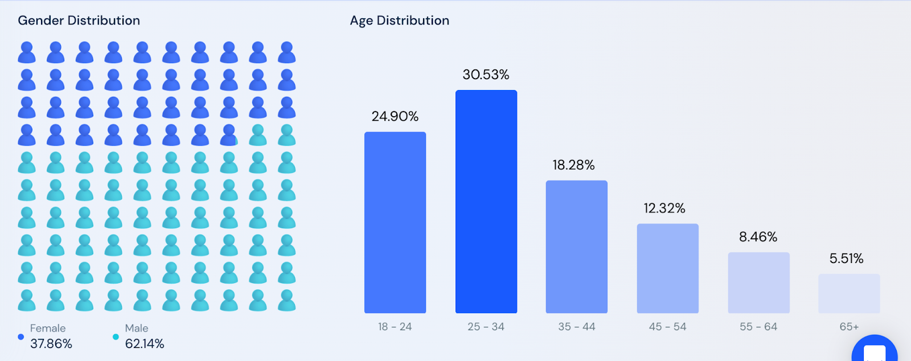

Your website focuses more on promoting through LinkedIn.

In [cybersecurityguide.org's](cybersecurityguide.org) case, Facebook is the top social media channel that directs traffic. What we recommend is looking for opportunities to engage audiences through Youtube or other networks.

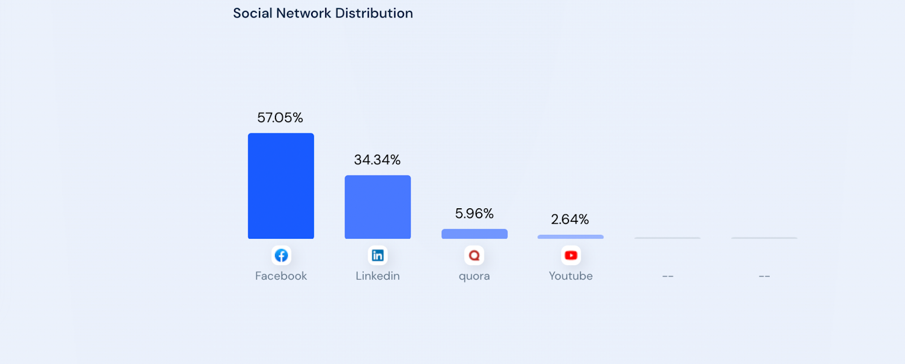

Now looking at [cyberdegrees.org's](cyberdegrees.org) social media distribution, LinkedIn is the top social media that directs traffic to the site. Unlike [cybersecurityguide.org](cybersecurityguide.org), LinkedIn is the cause of over 90% of social media traffic for the site. It can be helpful to look more into [cyberdegrees.org's](cyberdegrees.org) activity on LinkedIn to increase direct traffic to your site, since your company also uses LinkedIn. Something to note is that Reddit directs the least amount of traffic to [cyberdegrees.org](cyberdegrees.org), so it might not be the best social media to use.

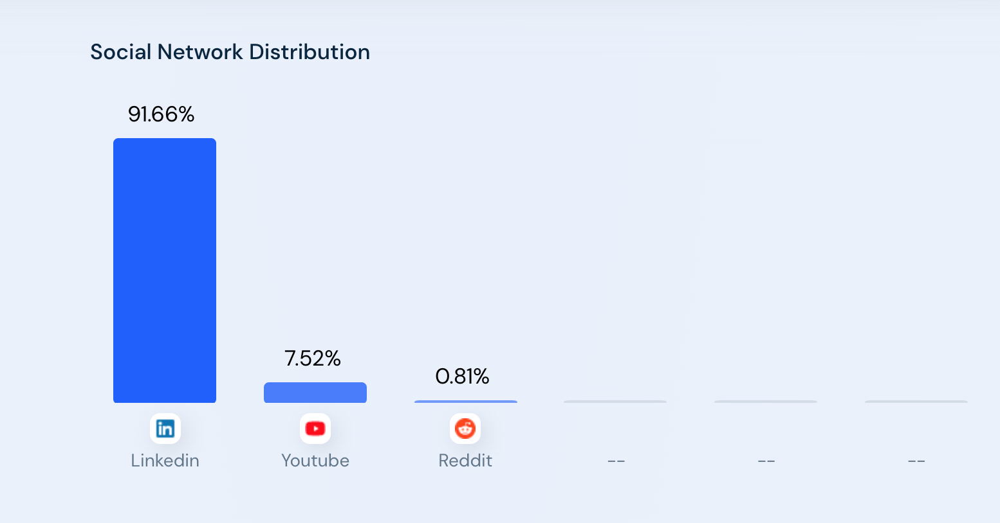

----------

## Audience

Now we're going to take a deeper look into your LinkedIn followers. As a side note, the four graphs from the next two slides are the top 5's for every category.

From the data that you provided, we saw that most of your audience on LinkedIn are from big cities with huge tech presence like the New York City area, Washington DC area, and the San Francisco Bay area. We also saw that your audience possessed varying levels of seniority in their workplace.

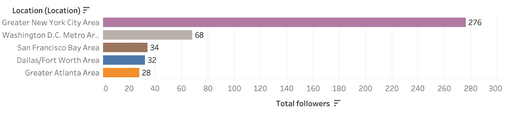

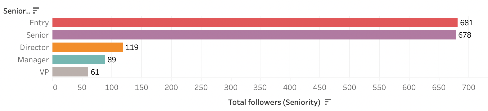

We can see that most of them are already in the tech industry, although we do see a good amount of them coming from other fields. So basically, your LinkedIn data shows us that your website is reaching the right target audience that you've told us you wanted to reach. People from varying levels in the industry are following you to improve their skills and hopefully move up in the industry, while you are also getting a good amount of people trying to use the information you're giving to them to possibly transition over to the cybersecurity field.

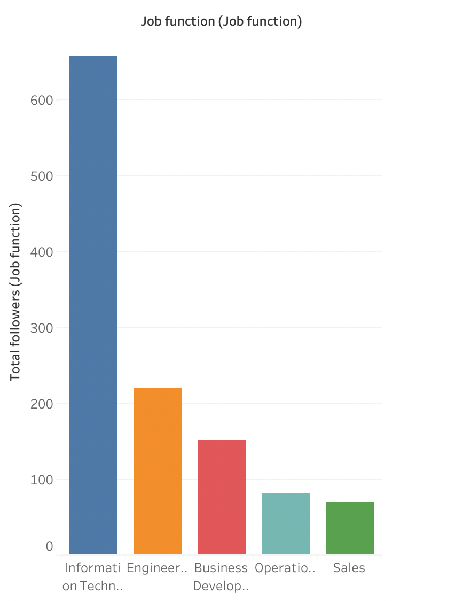

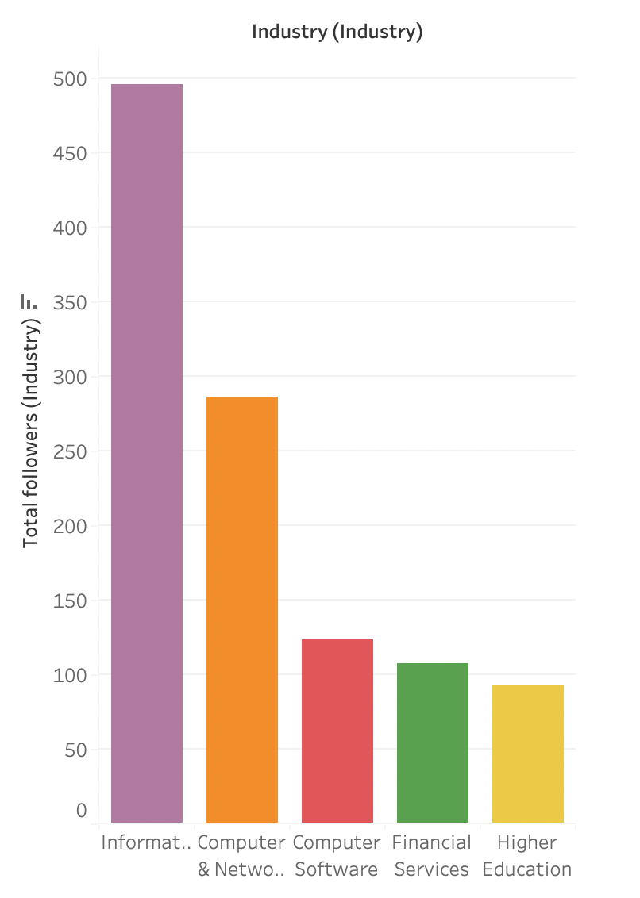

----------

## Social Media

To address the issue of lack of engagement, we recommend that your company follow the recommended time to post for each of the social media platforms. This data is from [Sprout Social](https://sproutsocial.com/) and it is a social media management and intelligence tool for brands. Now keep in mind these times are based on the CT time zone. According to Sprout Social, the best time to post on LinkedIn is on Tuesdays from 10am to noon, with Wednesdays and and Thursdays being the best days and the weekend being the worst days. For Instagram, the best time to post is on Mondays at 11am, Tuesdays and Wednesdays from 10am to 1pm, and on Thursdays and Fridays at 10am and 11am. The best days to post are Tuesdays and Wednesdays, and the worst day is on Sunday. As for Twitter, the best time to post is on Mondays to Wednesdays, Fridays, and Saturdays at 9am, with Tuesdays and Wednesdays being the best days to post, and Sundays being the worst day.


TikTok has become a growing platform for tech related careers. It is a starting point for many to learn about how to break into the tech world.  And here is why it’s a promising platform. There’s 1 billion monthly users worldwide and of that 1 billion, about 138 million are monthly users in the U.S alone. This is a great platform for your company to draw in audience. As far as age demographics, 29.5 % of the users are of age 20-29 and 16.4% are of age 30-39. This about 47% of the US monthly users, which should be your target audiences because they are the people that are are looking for a career or a career change. We strongly believe having a strong presence on TikTok will help increase organic traffic on your site, but it is important to follow a specific strategy. For example, speaking and highlighting the possibility of a high paying career in cybersecurity as well as job security through video contents will draw in those audiences. Last but not least, highlighting the free resources that’s available on your site would increase your website visitors.

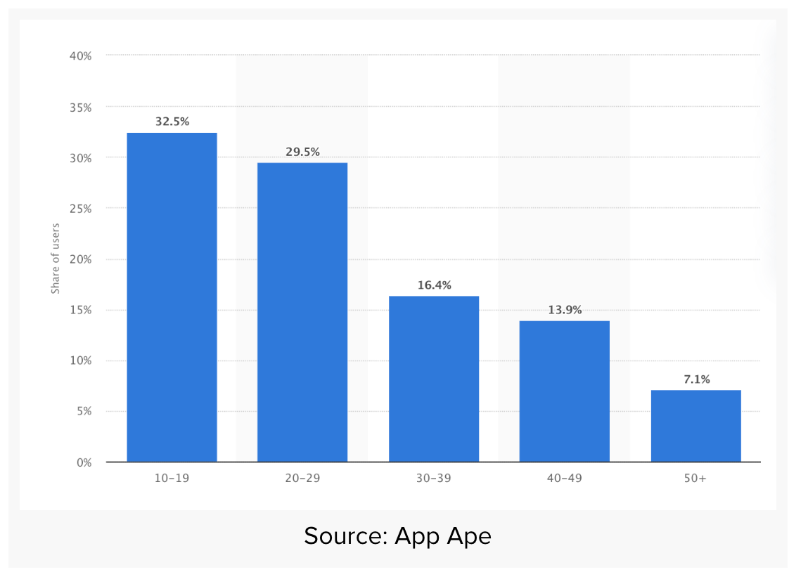

The following is a screenshot of the amount of views for TikTok content based on tech and cybersecurity topics. We wanted to point out specifically the amount of views TikTok videos have for tech and cyber-related content. In the first image, the circled portion represents the tech hashtags which show a total of 6 billion views for related tech contents. In the second image, it shows about 570 million views for cybersecurity. These two examples are one of many hashtags that content creators use to promote their services and products. This is why we see TikTok as a promising platform to increase engagement and grow your audience.

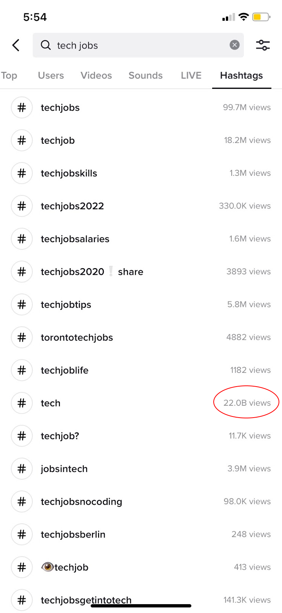

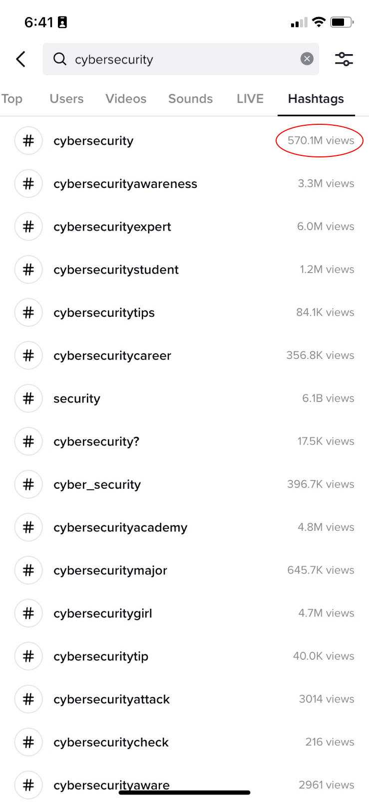

----------

## SEO

In addition to social media and marketing, a key part of expanding is the retention of the site's audience. This involves the practice of search engine optimization (SEO). This strategy involves carefully choosing strategies, techniques, tactics, content, and keywords to attract your audience of interest.

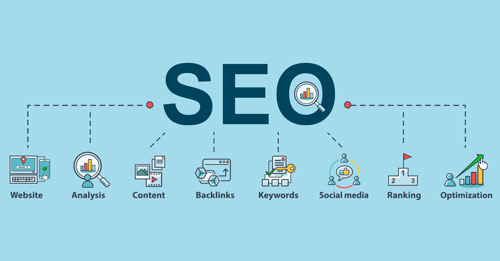

As mentioned, to improve your reach, you might consider the follow strategies:

- Utilize the keywords that were most often used by visitors to access your website and specific posts.
- You want to push content that is relevant to cybersecurity through various mediums:
  - webinars
  - panels
  - professional opinion pieces
- Update your content regularly
- Use alt tags, on relevant images or media, to increase visibility through search engines.

In regards to the particular keywords and phrases for the SEO of your website, we recommend incorporating metadata tags and using keywords like ***cybersecurity degree*** and ***cybersecurity certificate*** as titles on your posts to bring more organic traffic to the website. This in turn would improve your ranking in Google.


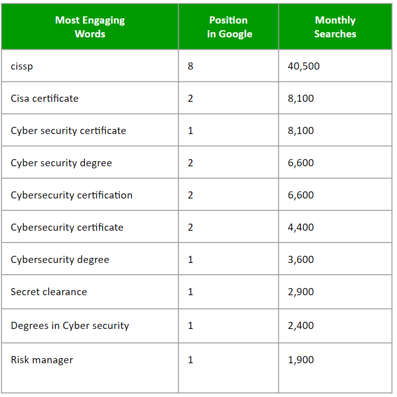

We examined other cybersecurity websites and identified strengths that could inspire future strategy on your site in aim to also influence your on and off-page SEO score.

**SimpliLearn Strengths**

- SimpliLearn had sections that were labeled using relevant cybersecurity terms
- They utilize industry aligned resources that include insights, tips and articles written by experts in a range of professional domains
- Focus on immersive learning experience

**Cybrary Strengths**

- Variety Of content, which includes:
 - Webinars
 - Case Studies
 - Beginner content

----------

## UX Design

To further improve user engagement and retention we decided to look at the the user experience. User experience refers to the way a visitor perceives your website’s usability and aesthetics. You want everyone who visits your site to have a good user experience. In order to gauge the audience’s user experience (UX) when visiting your website, we sent out a short 5-likert scale survey asking for the visitor’s understanding of the mission/purpose, user-friendliness and navigation, familiarity with cybersecurity, and recommendation of the website. The survey was voluntary and anonymous, and collected no personally identifiable information (PII). In total, we collected responses from a sample of 63 people. In no way was this representative of the population as a whole; however, this helped us gain valuable insights on how visitors may experience your website.

```{r, echo = TRUE, include = FALSE, results = FALSE, warning = FALSE, message = FALSE}
# Load data-----
survey_df <- read.csv("ux-survey.csv")
```

```{r, echo = TRUE, include = FALSE, results = FALSE, warning = FALSE, message = FALSE}
# Manipulate data-----
survey_df1 <- survey_df[2:5]

survey_df <- survey_df %>%
  select(-Timestamp)

survey_df["How.clear.was.the.mission.purpose.of.the.website."][survey_df["How.clear.was.the.mission.purpose.of.the.website."] == 1] <- "Not clear at all"
survey_df["How.clear.was.the.mission.purpose.of.the.website."][survey_df["How.clear.was.the.mission.purpose.of.the.website."] == 2] <- "Somewhat unclear"
survey_df["How.clear.was.the.mission.purpose.of.the.website."][survey_df["How.clear.was.the.mission.purpose.of.the.website."] == 3] <- "Neutral"
survey_df["How.clear.was.the.mission.purpose.of.the.website."][survey_df["How.clear.was.the.mission.purpose.of.the.website."] == 4] <- "Somewhat clear"
survey_df["How.clear.was.the.mission.purpose.of.the.website."][survey_df["How.clear.was.the.mission.purpose.of.the.website."] == 5] <- "Very clear"

survey_df["How.easy.user.friendly.was.it.to.navigate.the.website."][survey_df["How.easy.user.friendly.was.it.to.navigate.the.website."] == 1] <- "Not user-friendly"
survey_df["How.easy.user.friendly.was.it.to.navigate.the.website."][survey_df["How.easy.user.friendly.was.it.to.navigate.the.website."] == 2] <- "Somewhat not user-friendly"
survey_df["How.easy.user.friendly.was.it.to.navigate.the.website."][survey_df["How.easy.user.friendly.was.it.to.navigate.the.website."] == 3] <- "Neutral"
survey_df["How.easy.user.friendly.was.it.to.navigate.the.website."][survey_df["How.easy.user.friendly.was.it.to.navigate.the.website."] == 4] <- "Somewhat user-friendly"
survey_df["How.easy.user.friendly.was.it.to.navigate.the.website."][survey_df["How.easy.user.friendly.was.it.to.navigate.the.website."] == 5] <- "Very user-friendly"

survey_df["How.familiar.are.you.with.Cyber.Security."][survey_df["How.familiar.are.you.with.Cyber.Security."] == 1] <- "Not familiar"
survey_df["How.familiar.are.you.with.Cyber.Security."][survey_df["How.familiar.are.you.with.Cyber.Security."] == 2] <- "Somewhat unfamiliar"
survey_df["How.familiar.are.you.with.Cyber.Security."][survey_df["How.familiar.are.you.with.Cyber.Security."] == 3] <- "Neutral"
survey_df["How.familiar.are.you.with.Cyber.Security."][survey_df["How.familiar.are.you.with.Cyber.Security."] == 4] <- "Somewhat familiar"
survey_df["How.familiar.are.you.with.Cyber.Security."][survey_df["How.familiar.are.you.with.Cyber.Security."] == 5] <- "Very familiar"

survey_df["How.likely.are.you.to.recommend.this.website."][survey_df["How.likely.are.you.to.recommend.this.website."] == 1] <- "Not at all"
survey_df["How.likely.are.you.to.recommend.this.website."][survey_df["How.likely.are.you.to.recommend.this.website."] == 2] <- "Somewhat unlikely"
survey_df["How.likely.are.you.to.recommend.this.website."][survey_df["How.likely.are.you.to.recommend.this.website."] == 3] <- "Neutral"
survey_df["How.likely.are.you.to.recommend.this.website."][survey_df["How.likely.are.you.to.recommend.this.website."] == 4] <- "Somewhat likely"
survey_df["How.likely.are.you.to.recommend.this.website."][survey_df["How.likely.are.you.to.recommend.this.website."] == 5] <- "Very likely"

survey_df$How.clear.was.the.mission.purpose.of.the.website. <- factor(survey_df$How.clear.was.the.mission.purpose.of.the.website.,
                             levels = c("Not clear at all", "Somewhat unclear", "Neutral", "Somewhat clear", "Very clear"),
                             ordered = TRUE)

survey_df$How.easy.user.friendly.was.it.to.navigate.the.website. <- factor(survey_df$How.easy.user.friendly.was.it.to.navigate.the.website.,
                             levels = c("Not user-friendly", "Somewhat not user-friendly", "Neutral", "Somewhat user-friendly", "Very user-friendly"),
                             ordered = TRUE)

survey_df$How.familiar.are.you.with.Cyber.Security. <- factor(survey_df$How.familiar.are.you.with.Cyber.Security.,
                             levels = c("Not familiar", "Somewhat unfamiliar", "Neutral", "Somewhat familiar", "Very familiar"),
                             ordered = TRUE)

survey_df$How.likely.are.you.to.recommend.this.website. <- factor(survey_df$How.likely.are.you.to.recommend.this.website.,
                             levels = c("Not at all", "Somewhat unlikely", "Neutral", "Somewhat likely", "Very likely"),
                             ordered = TRUE)

survey_df_Mission <- data.frame(survey_df$How.clear.was.the.mission.purpose.of.the.website.)
survey_df_Navigate <- data.frame(survey_df$How.easy.user.friendly.was.it.to.navigate.the.website.)
survey_df_Familiar <- data.frame(survey_df$How.familiar.are.you.with.Cyber.Security.)
survey_df_Recommend <- data.frame(survey_df$How.likely.are.you.to.recommend.this.website.)

names(survey_df_Mission)[names(survey_df_Mission) == "survey_df.How.clear.was.the.mission.purpose.of.the.website."] <- "How clear was the mission/purpose of the website?"

names(survey_df_Navigate)[names(survey_df_Navigate) == "survey_df.How.easy.user.friendly.was.it.to.navigate.the.website."] <- "How easy/user-friendly was it to navigate the website?"

names(survey_df_Familiar)[names(survey_df_Familiar) == "survey_df.How.familiar.are.you.with.Cyber.Security."] <- "How familiar are you with Cyber Security?"

names(survey_df_Recommend)[names(survey_df_Recommend) == "survey_df.How.likely.are.you.to.recommend.this.website."] <- "How likely are you to recommend this website?"
```

Let’s dive into the distribution of responses for each of the questions. In this data visualization, we can see the distribution of the survey responses for the first question **How clear was the mission/purpose of the website?**. The mission/purpose of the website was clear to 60% of survey respondents, and unclear to 24%. The average of all responses is 3.67, signaling that visitors understand the mission/purpose clearly when they visit the website.

```{r, echo = FALSE, results = FALSE, warning = FALSE, message = FALSE, fig.width = 10, fig.height = 2}
# Data visualization-----
plot(likert(survey_df_Mission), legend.position = "right") +
  labs(subtitle = paste("n = ", nrow(survey_df_Mission)))
```

For the next question **How easy/user-friendly was it to navigate the website?**, this barplot shows us that most of the survey respondents lean toward the site being easy to navigate and user-friendly. Only 19% voted the site to be not user-friendly. The average of all responses is 3.90, indicating that the website’s navigation structure is effective in helping visitors find what they want.

```{r, echo = FALSE, results = FALSE, warning = FALSE, message = FALSE, fig.width = 10, fig.height = 2}
# Data visualization-----
plot(likert(survey_df_Navigate), legend.position = "right") +
  labs(subtitle = paste("n = ", nrow(survey_df_Navigate)))
```

For the next question **How familiar are you with cyber security?**, most people responded with being unfamiliar with cybersecurity. Only 21% voted that they were familiar with cybersecurity. The average of all responses is 2.52, which means that most of the visitors are not familiar with cybersecurity.

```{r, echo = FALSE, results = FALSE, warning = FALSE, message = FALSE, fig.width = 10, fig.height = 2}
# Data visualization-----
plot(likert(survey_df_Familiar), legend.position = "right") +
  labs(subtitle = paste("n = ", nrow(survey_df_Familiar)))
```

For the last question **How likely are you to recommend this website?**, 41% responded with Very likely, while 22% responded with Not at all. On average, visitors are likely to recommend the website to others with an average response of 3.22.

```{r, echo = FALSE, results = FALSE, warning = FALSE, message = FALSE, fig.width = 10, fig.height = 2}
# Data visualization-----
plot(likert(survey_df_Recommend), legend.position = "right") +
  labs(subtitle = paste("n = ", nrow(survey_df_Recommend)))
```

Next, we wanted to analyze if there were any correlations between the survey questions. We observed strong positive correlations between understanding the mission/purpose, user-friendliness and website navigation, and recommending the site. This indicates that positive responses of one question frequently occurred with positive responses of another question. On the other hand, we observed a weaker positive correlation for familiarity of cybersecurity, indicating that responses for having background in cybersecurity do not predict the other responses. This makes sense because being familiar with cybersecurity does not affect a website’s UX design.

```{r, echo = TRUE, include = FALSE, results = FALSE, warning = FALSE, message = FALSE}
# Load data-----
corr_df <- read.csv("corr_df.csv", row.names = 1)
```

```{r, echo = TRUE, include = FALSE, results = FALSE, warning = FALSE, message = FALSE}
# Manipulate data-----
polychor(survey_df1[,1],survey_df1[,2]); polychor(survey_df1[,1],survey_df1[,3]); polychor(survey_df1[,1],survey_df1[,4])

polychor(survey_df1[,2],survey_df1[,3]); polychor(survey_df1[,2],survey_df1[,4])

polychor(survey_df1[,3],survey_df1[,4])

corr_df[1,1] <- 1
corr_df[2,2] <- 1
corr_df[3,3] <- 1
corr_df[4,4] <- 1

corr_df[1,2] <- polychor(survey_df1[,1],survey_df1[,2])
corr_df[2,1] <- polychor(survey_df1[,1],survey_df1[,2])

corr_df[1,3] <- polychor(survey_df1[,1],survey_df1[,3])
corr_df[3,1] <- polychor(survey_df1[,1],survey_df1[,3])

corr_df[1,4] <- polychor(survey_df1[,1],survey_df1[,4])
corr_df[4,1] <- polychor(survey_df1[,1],survey_df1[,4])

corr_df[2,3] <- polychor(survey_df1[,2],survey_df1[,3])
corr_df[3,2] <- polychor(survey_df1[,2],survey_df1[,3])

corr_df[2,4] <- polychor(survey_df1[,2],survey_df1[,4])
corr_df[4,2] <- polychor(survey_df1[,2],survey_df1[,4])

corr_df[3,4] <- polychor(survey_df1[,3],survey_df1[,4])
corr_df[4,3] <- polychor(survey_df1[,3],survey_df1[,4])

corrdf <- as.matrix(corr_df)
```

```{r, echo = FALSE, results = FALSE, warning = FALSE, message = FALSE, fig.width = 10}
# Data visualization-----
corrplot(corrdf,
         order = "AOE",
         addCoef.col = 'black',
         tl.pos = "l",
         tl.col = "black",
         tl.cex = 0.8,
         col = COL2("RdYlBu"))
```
In addition to those four questions, we also asked the visitors for areas of improvement for the website. Some suggestions we wanted to highlight include: 

- Making the website more functional and fluid
- Revising the overall UX design
- Updating the menu tab items with more concise categories to help guide visitors and give more direction to their session (which was recommended 3 times by users)
- Changing the “Start Here” page to be the landing page, as it should be the first thing users see (which was recommended 5 times by users)

Taking in the survey feedback and what we know about design and user experience, we broke down the insights into a few simple steps to revamp your website. Good UX practice is to engage the audience by keeping things concise, intentional, each page has a single definitive purpose. Too much overwhelms the audience and is an instant user experience turn-off. Therefore, the very first page that the website opens on should be your “mission” page. It should concisely summarize 3 things:

- the purpose of the website and your mission
- the strategy to accomplish this mission
- the important element on this page → the call to action

This  button should vibrant or stand out. For example: *click here for resources* or *click here to start*. And this button will then redirect the audience to the resources page.

To make the resources page more impactful, we recommend your website to incorporate the following:

- Denote which resources are *FREE*
- Provide a brief description for each link
- Group Resources by Novice, Intermediate, Advanced
  - Or, by “Looking to get into Cyber Security” vs. “Looking to Climb”
- Include a built-in feature like a survey that asks if the link or article was useful

If everything is labeled by categories of interest, this will decrease the chances the users get overwhelmed and help them navigate to the resources they specifically need. Better organization leads to a more tailored user experience.

To help you visualize what the resources page can look like, here’s an example which we acquired from [cyberdegrees.org](cyberdegrees.org). As you can see here, the resources stand out, have a quick description, and keywords that will attract the correct audience, but also overall improve your place in Google searches (SEO).


----------

# **Conclusion**

## Observations and Insights

To recap our main points:

Your website's spike can potentially be correlated with the articles you post in relation to what is currently going on, for example, the COVID-19 article that was posted. There should also be awareness that when you and your team access the site; it does contribute to the overall increase your site will get in terms of clicks, visitors, etc. Audiences for your competitors all seem to have the same demographic ages ranging from 18-34. To recap the main points from the LinkedIn audience data, the majority of your followers are based in NY, DC, and SF, and come from tech backgrounds, which means you are successful in reaching your target audience. Based on our survey, most people who understood the mission/purpose of the website found the website to be user-friendly and easy to navigate. A large portion of the people who voted the website navigation positively were unfamiliar with cybersecurity. But people who were unfamiliar with cybersecurity still voted to recommend the website. This indicates that a visitor’s familiarity with cybersecurity does not affect how they experience your website.

----------

## Recommendations

The recommendations for your website are the following:

- Track ads in social media to see which specific social media space generates more viewers.
- Implement monthly newsletter with new resources.
- Schedule content to post on social media and increase social media presence with TikTok.
- Youtube is also another untapped potential.  If an individual is interested in a certain topic, in this case, cybersecurity, then Youtube will suggest videos related to that topic. It serves as free marketing but will work if consistent posting is enabled and could be delegated to you or one of your team members.

----------