Client Data Project: Cybersecurity Company
================
Cohort 194

-   [**Introduction**](#introduction)
    -   [Goals and Objectives](#goals-and-objectives)
-   [**Data Set**](#data-set)
    -   [Dataset](#dataset)
-   [**Analysis**](#analysis)
    -   [Website Breakdown](#website-breakdown)
    -   [Competitors](#competitors)
    -   [Audience](#audience)
    -   [Social Media](#social-media)
    -   [SEO](#seo)
    -   [UX Design](#ux-design)
-   [**Conclusion**](#conclusion)
    -   [Observations and Insights](#observations-and-insights)
    -   [Recommendations](#recommendations)

**Note:** Please note that our cohort was assigned an actual
cybersecurity company. However, the data was considered company property
and a proprietary secret, even though some of the data originated from
customers’ private behavior. So we have removed all instances of the
company’s name when sharing this project.

# **Introduction**

## Goals and Objectives

For this project, we have identified three goals:

1.  increase followers
2.  increase retention
3.  increase engagement

And based on those goals, our team’s objectives will be to:

-   profile the audience
-   determine audience preferences
-   identify engagement strategies
-   survey user experience

------------------------------------------------------------------------

# **Data Set**

## Dataset

We decided to take a deeper dive and analyzed data provided by the
company through:

-   Statcounter
-   LinkedIn
-   Twitter

We also obtained additional data through data scraping from external
sources like:

-   Similarweb
-   SurveyMonkey

------------------------------------------------------------------------

# **Analysis**

## Website Breakdown

The following data visualizations will show visitors, new visitors, and
location on where the audience is coming from. Now just know, the
following visualizations do include you and your team’s visits/clicks on
the website as well.

Based on the following map, the majority of the visitors are located in
New York. The top five states are: (1) New York, (2) Texas, (3)
California, (4) Virginia, and (5) Florida. The top three states are big
tech states, which gives you the motive to look into different tech
conventions, meetings, and forums in which you could potentially sign up
as a guest speaker or panelist. This is an opportunity to gain exposure
within the tech community to establish credibility in which you can
network and get revenue generating to your website.

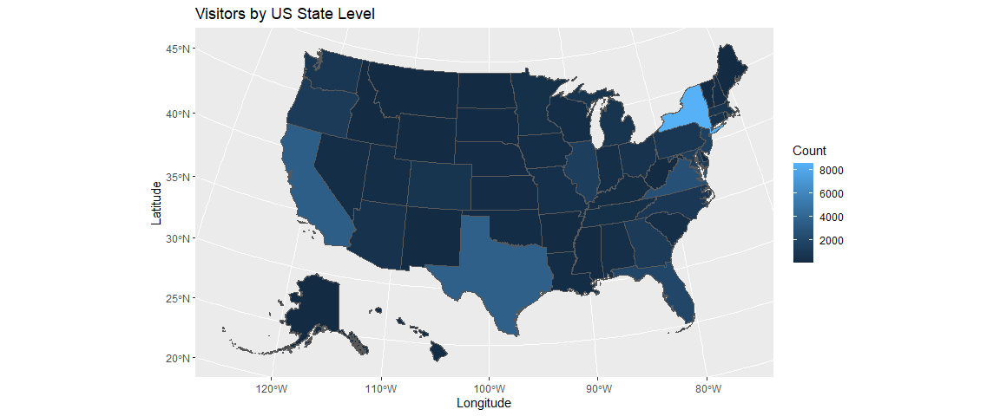<!-- -->

Looking at this data visualization, we can see that your visitors are
slowly growing, meaning you are generating traffic to the site. You do
have a total of 48,201 visitors, a daily average of 62.52 visitors, and
a daily average of 52.34 new visitors.

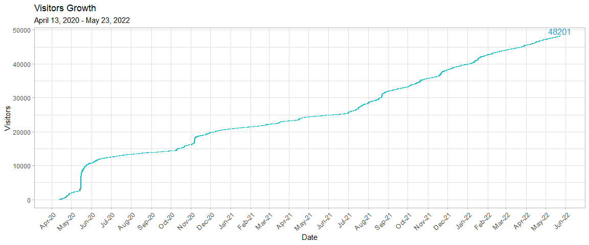<!-- -->

However, you do have a large amount of visitors for less than 5 seconds.
Don’t worry. After this section, we have further analysis of different
marketing strategies and suggestions that can potentially increase the
amount of time visitors stay on your site.

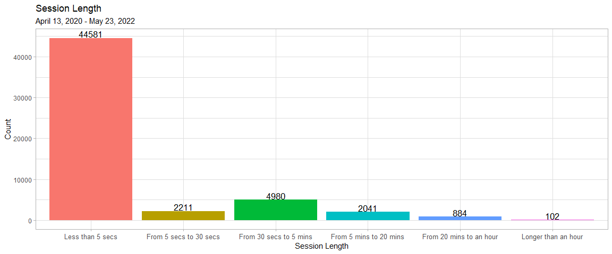<!-- -->

You do have visitors that are coming back. The spikes could be linked to
certain articles you post, based on what is currently going on in the
world, for example, the COVID-19 article that was posted during the
start of the pandemic.

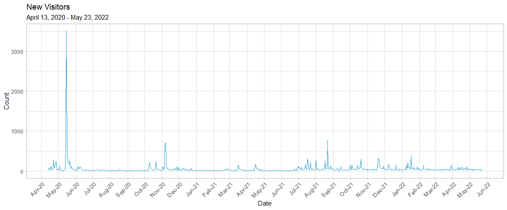<!-- -->

As mentioned earlier, the data provided does include you and your team.
We were able to show the difference in clicks on your website with your
team and without your team included.

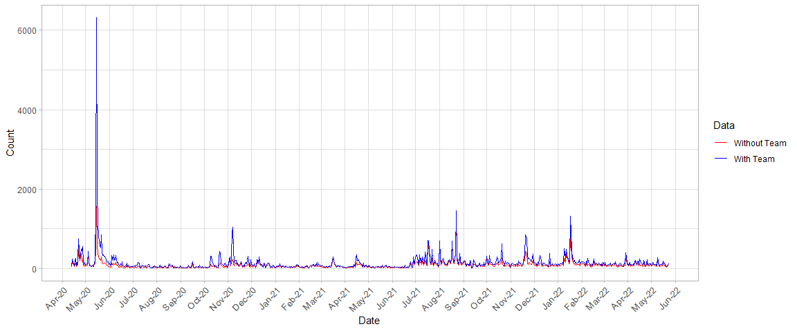<!-- -->

As you can see, the spikes still remain consistent within your website,
which is a good thing. The only difference your team has is that it
impacts it on a much larger scale.

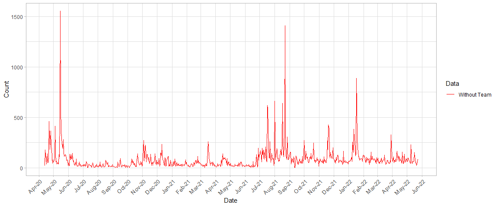<!-- -->

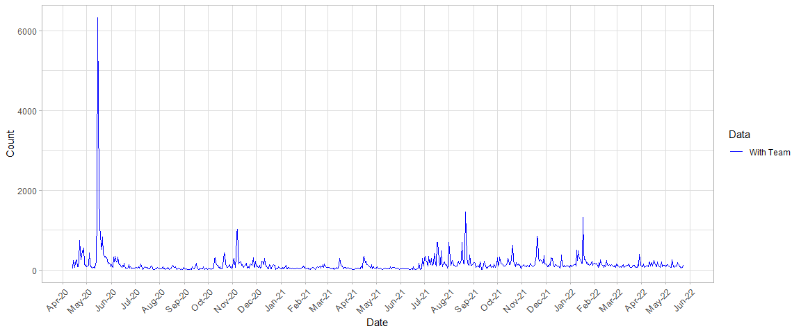<!-- -->

------------------------------------------------------------------------

## Competitors

Now that we have a grasp of what your website looks like, we’ll take a
closer look at the audience followed by the social distribution of your
competitors.

Your audience consists of 37.86% female, and 62.14% male. Your website
also has the highest female demographic amongst its competitors. Posting
resources that directly target women in tech, such as information on
women-only cybersecurity internships, would appeal more to this
audience.

However, as discussed before, you are hitting your age demographic. A
recommendation to increase this demographic could be linked to marketing
strategies such as social media.

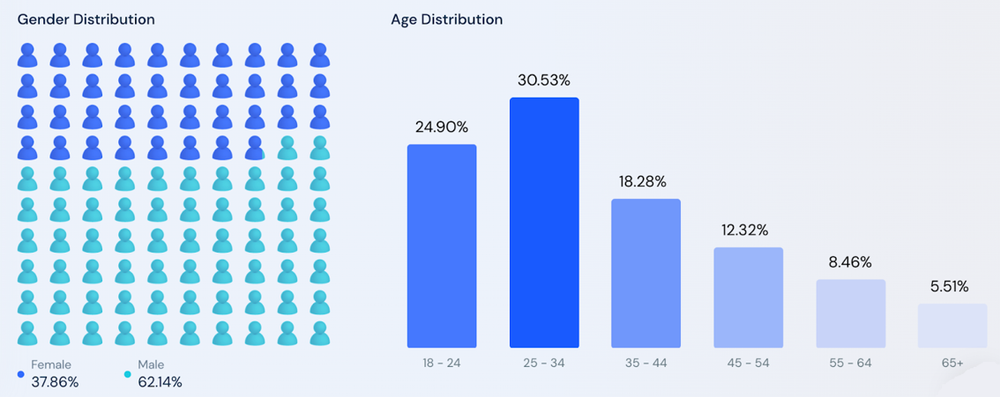<!-- -->

Your website focuses more on promoting through LinkedIn.

In [cybersecurityguide.org’s](cybersecurityguide.org) case, Facebook is
the top social media channel that directs traffic. What we recommend is
looking for opportunities to engage audiences through Youtube or other
networks.

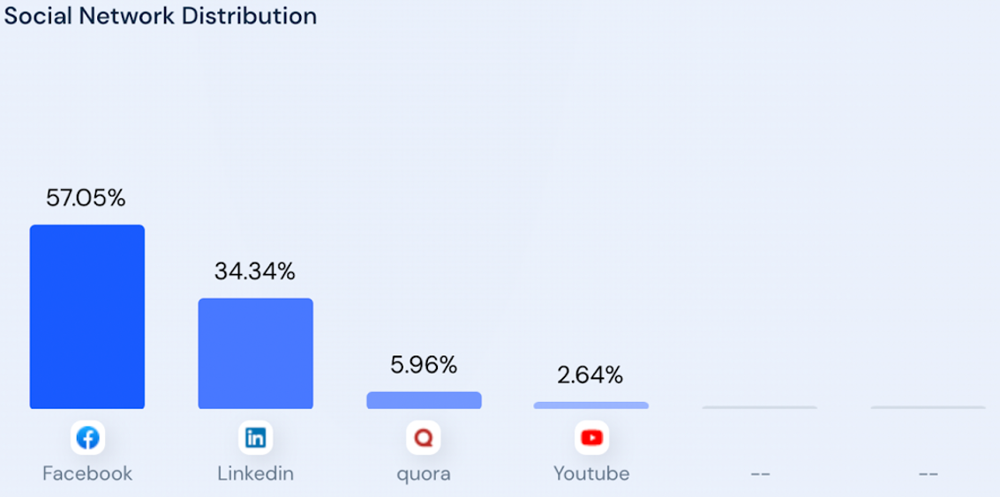<!-- -->

Now looking at [cyberdegrees.org’s](cyberdegrees.org) social media
distribution, LinkedIn is the top social media that directs traffic to
the site. Unlike [cybersecurityguide.org](cybersecurityguide.org),
LinkedIn is the cause of over 90% of social media traffic for the site.
It can be helpful to look more into
[cyberdegrees.org’s](cyberdegrees.org) activity on LinkedIn to increase
direct traffic to your site, since your company also uses LinkedIn.
Something to note is that Reddit directs the least amount of traffic to
[cyberdegrees.org](cyberdegrees.org), so it might not be the best social
media to use.

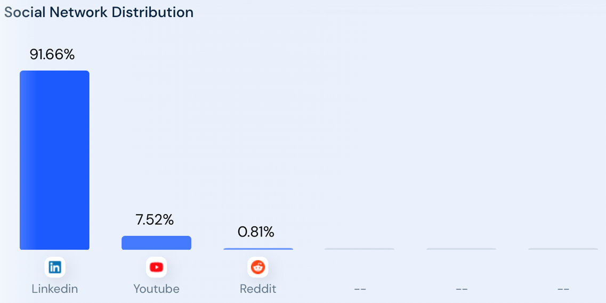<!-- -->

------------------------------------------------------------------------

## Audience

Now we’re going to take a deeper look into your LinkedIn followers. As a
side note, the four graphs from the next two slides are the top 5’s for
every category.

From the data that you provided, we saw that most of your audience on
LinkedIn are from big cities with huge tech presence like the New York
City area, Washington DC area, and the San Francisco Bay area. We also
saw that your audience possessed varying levels of seniority in their
workplace.

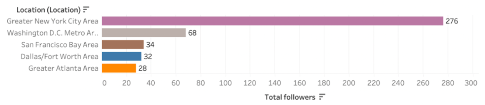<!-- -->

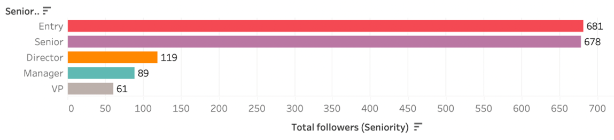<!-- -->

We can see that most of them are already in the tech industry, although
we do see a good amount of them coming from other fields. So basically,
your LinkedIn data shows us that your website is reaching the right
target audience that you’ve told us you wanted to reach. People from
varying levels in the industry are following you to improve their skills
and hopefully move up in the industry, while you are also getting a good
amount of people trying to use the information you’re giving to them to
possibly transition over to the cybersecurity field.

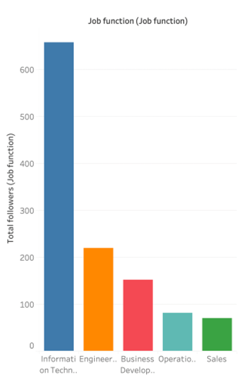<!-- -->

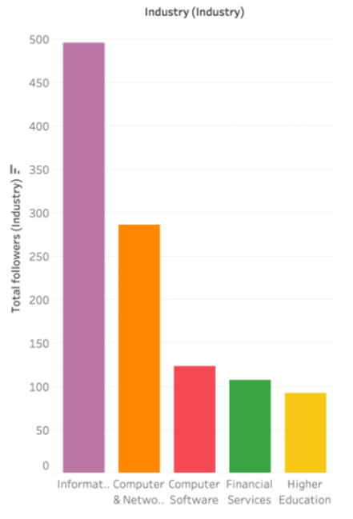<!-- -->

------------------------------------------------------------------------

## Social Media

To address the issue of lack of engagement, we recommend that your
company follow the recommended time to post for each of the social media
platforms. This data is from [Sprout Social](https://sproutsocial.com/)
and it is a social media management and intelligence tool for brands.
Now keep in mind these times are based on the CT time zone. According to
Sprout Social, the best time to post on LinkedIn is on Tuesdays from
10am to noon, with Wednesdays and and Thursdays being the best days and
the weekend being the worst days. For Instagram, the best time to post
is on Mondays at 11am, Tuesdays and Wednesdays from 10am to 1pm, and on
Thursdays and Fridays at 10am and 11am. The best days to post are
Tuesdays and Wednesdays, and the worst day is on Sunday. As for Twitter,
the best time to post is on Mondays to Wednesdays, Fridays, and
Saturdays at 9am, with Tuesdays and Wednesdays being the best days to
post, and Sundays being the worst day.

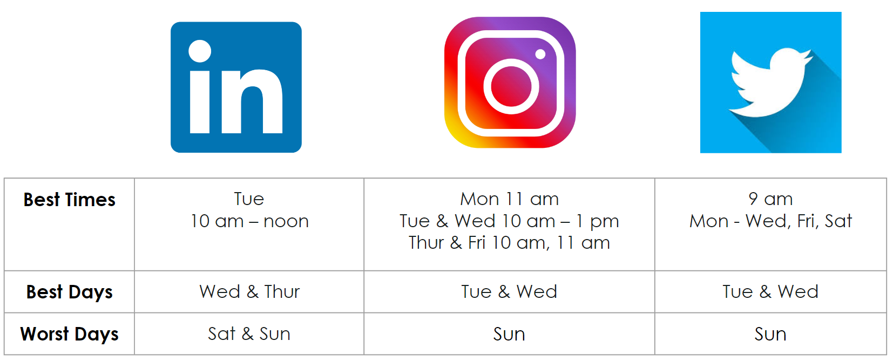<!-- -->

TikTok has become a growing platform for tech related careers. It is a
starting point for many to learn about how to break into the tech world.
And here is why it’s a promising platform. There’s 1 billion monthly
users worldwide and of that 1 billion, about 138 million are monthly
users in the U.S alone. This is a great platform for your company to
draw in audience. As far as age demographics, 29.5 % of the users are of
age 20-29 and 16.4% are of age 30-39. This about 47% of the US monthly
users, which should be your target audiences because they are the people
that are are looking for a career or a career change. We strongly
believe having a strong presence on TikTok will help increase organic
traffic on your site, but it is important to follow a specific strategy.
For example, speaking and highlighting the possibility of a high paying
career in cybersecurity as well as job security through video contents
will draw in those audiences. Last but not least, highlighting the free
resources that’s available on your site would increase your website
visitors.

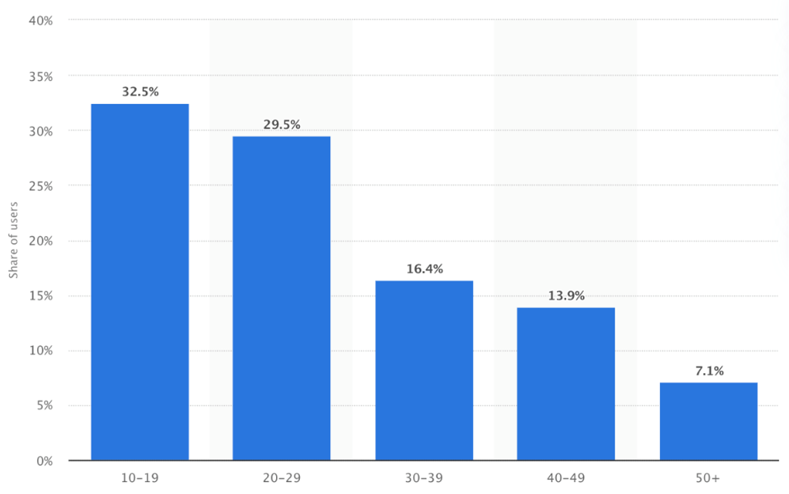<!-- -->

The following is a screenshot of the amount of views for TikTok content
based on tech and cybersecurity topics. We wanted to point out
specifically the amount of views TikTok videos have for tech and
cyber-related content. In the first image, the circled portion
represents the tech hashtags which show a total of 6 billion views for
related tech contents. In the second image, it shows about 570 million
views for cybersecurity. These two examples are one of many hashtags
that content creators use to promote their services and products. This
is why we see TikTok as a promising platform to increase engagement and
grow your audience.

<!-- -->

<!-- -->

------------------------------------------------------------------------

## SEO

In addition to social media and marketing, a key part of expanding is
the retention of the site’s audience. This involves the practice of
search engine optimization (SEO). This strategy involves carefully
choosing strategies, techniques, tactics, content, and keywords to
attract your audience of interest.

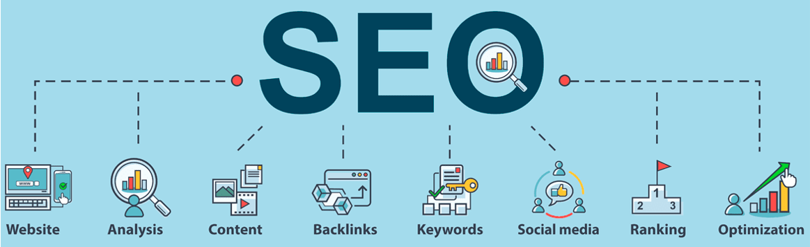<!-- -->

As mentioned, to improve your reach, you might consider the follow
strategies:

-   Utilize the keywords that were most often used by visitors to access
    your website and specific posts.
-   You want to push content that is relevant to cybersecurity through
    various mediums:
    -   webinars
    -   panels
    -   professional opinion pieces
-   Update your content regularly
-   Use alt tags, on relevant images or media, to increase visibility
    through search engines.

In regards to the particular keywords and phrases for the SEO of your
website, we recommend incorporating metadata tags and using keywords
like ***cybersecurity degree*** and ***cybersecurity certificate*** as
titles on your posts to bring more organic traffic to the website. This
in turn would improve your ranking in Google.

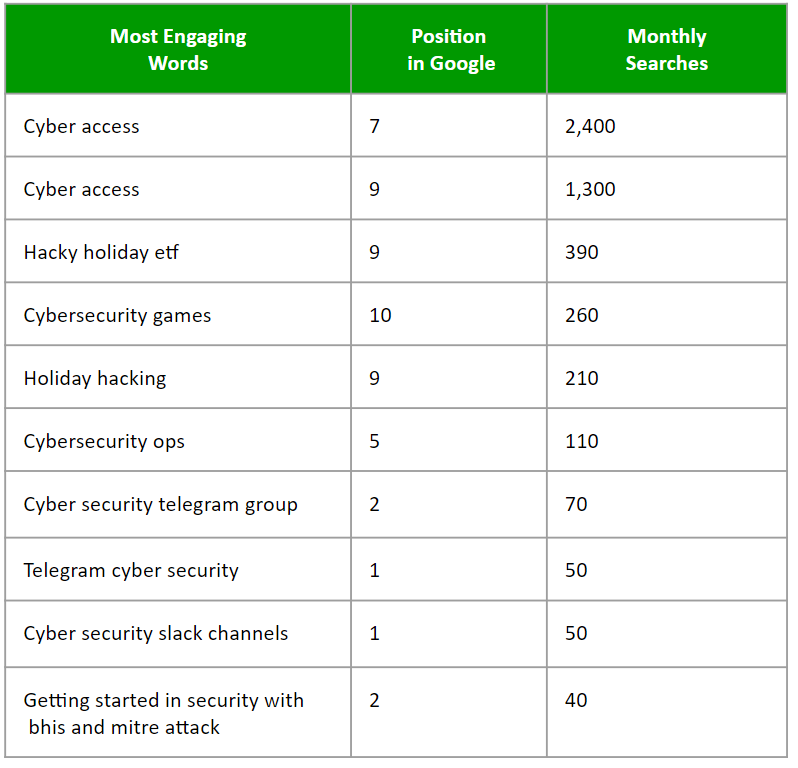<!-- -->

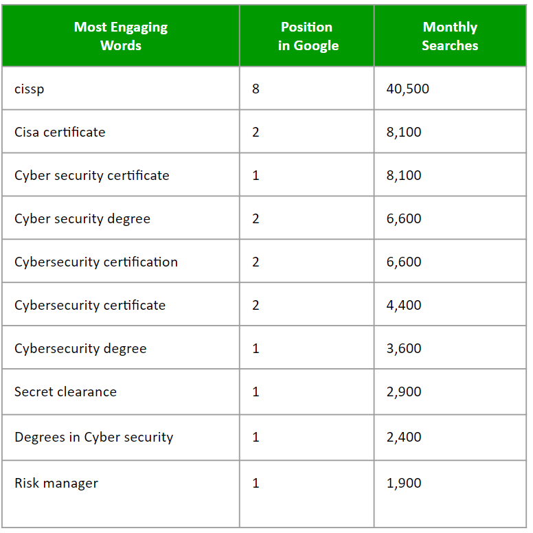<!-- -->

We examined other cybersecurity websites and identified strengths that
could inspire future strategy on your site in aim to also influence your
on and off-page SEO score.

**SimpliLearn Strengths**

-   SimpliLearn had sections that were labeled using relevant
    cybersecurity terms
-   They utilize industry aligned resources that include insights, tips
    and articles written by experts in a range of professional domains
-   Focus on immersive learning experience

**Cybrary Strengths**

-   Variety Of content, which includes:
-   Webinars
-   Case Studies
-   Beginner content

------------------------------------------------------------------------

## UX Design

To further improve user engagement and retention we decided to look at
the the user experience. User experience refers to the way a visitor
perceives your website’s usability and aesthetics. You want everyone who
visits your site to have a good user experience. In order to gauge the
audience’s user experience (UX) when visiting your website, we sent out
a short 5-likert scale survey asking for the visitor’s understanding of
the mission/purpose, user-friendliness and navigation, familiarity with
cybersecurity, and recommendation of the website. The survey was
voluntary and anonymous, and collected no personally identifiable
information (PII). In total, we collected responses from a sample of 63
people. In no way was this representative of the population as a whole;
however, this helped us gain valuable insights on how visitors may
experience your website.

Let’s dive into the distribution of responses for each of the questions.
In this data visualization, we can see the distribution of the survey
responses for the first question **How clear was the mission/purpose of
the website?**. The mission/purpose of the website was clear to 60% of
survey respondents, and unclear to 24%. The average of all responses is
3.67, signaling that visitors understand the mission/purpose clearly
when they visit the website.

<!-- -->

For the next question **How easy/user-friendly was it to navigate the
website?**, this barplot shows us that most of the survey respondents
lean toward the site being easy to navigate and user-friendly. Only 19%
voted the site to be not user-friendly. The average of all responses is
3.90, indicating that the website’s navigation structure is effective in
helping visitors find what they want.

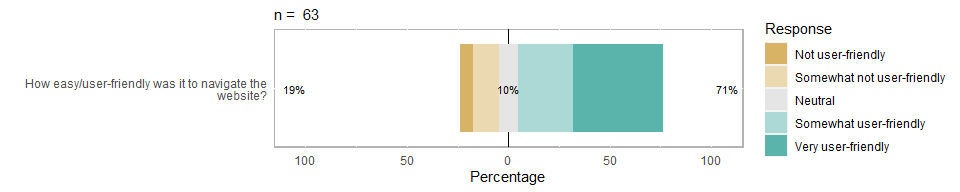<!-- -->

For the next question **How familiar are you with cyber security?**,
most people responded with being unfamiliar with cybersecurity. Only 21%
voted that they were familiar with cybersecurity. The average of all
responses is 2.52, which means that most of the visitors are not
familiar with cybersecurity.

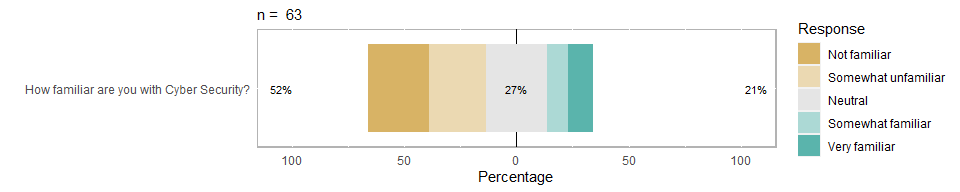<!-- -->

For the last question **How likely are you to recommend this website?**,
41% responded with Very likely, while 22% responded with Not at all. On
average, visitors are likely to recommend the website to others with an
average response of 3.22.

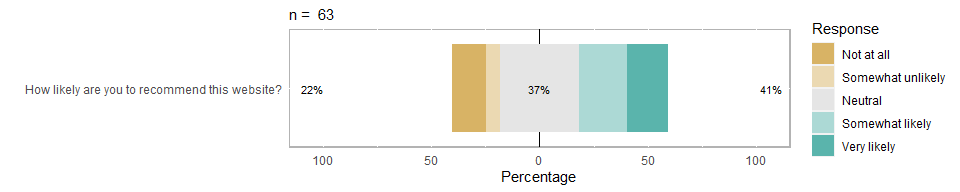<!-- -->

The following two data visualizations are a heatmap and a density plot
that shows the distribution of the survey responses.

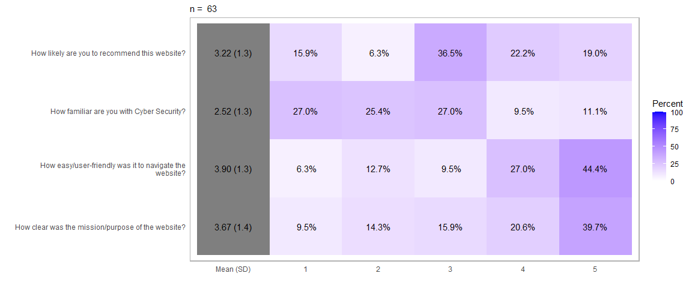<!-- -->

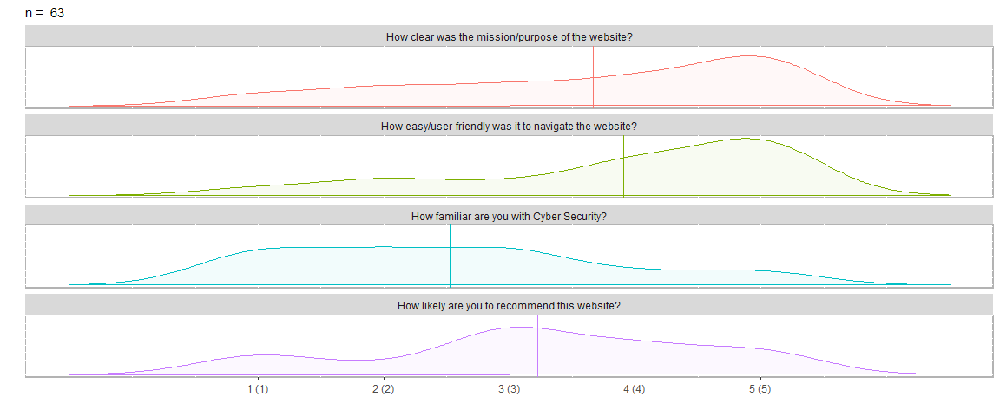<!-- -->

Next, we wanted to analyze if there were any correlations between the
survey questions. We observed strong positive correlations between
understanding the mission/purpose, user-friendliness and website
navigation, and recommending the site. This indicates that positive
responses of one question frequently occurred with positive responses of
another question. On the other hand, we observed a weaker positive
correlation for familiarity of cybersecurity, indicating that responses
for having background in cybersecurity do not predict the other
responses. This makes sense because being familiar with cybersecurity
does not affect a website’s UX design.

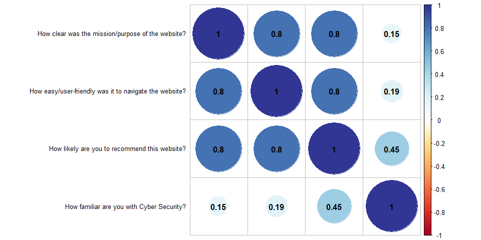<!-- -->
In addition to those four questions, we also asked the visitors for
areas of improvement for the website. Some suggestions we wanted to
highlight include:

-   Making the website more functional and fluid
-   Revising the overall UX design
-   Updating the menu tab items with more concise categories to help
    guide visitors and give more direction to their session (which was
    recommended 3 times by users)
-   Changing the “Start Here” page to be the landing page, as it should
    be the first thing users see (which was recommended 5 times by
    users)

Taking in the survey feedback and what we know about design and user
experience, we broke down the insights into a few simple steps to revamp
your website. Good UX practice is to engage the audience by keeping
things concise, intentional, each page has a single definitive purpose.
Too much overwhelms the audience and is an instant user experience
turn-off. Therefore, the very first page that the website opens on
should be your “mission” page. It should concisely summarize 3 things:

-   the purpose of the website and your mission
-   the strategy to accomplish this mission
-   the important element on this page → the call to action

This button should vibrant or stand out. For example: *click here for
resources* or *click here to start*. And this button will then redirect
the audience to the resources page.

To make the resources page more impactful, we recommend your website to
incorporate the following:

-   Denote which resources are *FREE*
-   Provide a brief description for each link
-   Group Resources by Novice, Intermediate, Advanced
    -   Or, by “Looking to get into Cyber Security” vs. “Looking to
        Climb”
-   Include a built-in feature like a survey that asks if the link or
    article was useful

If everything is labeled by categories of interest, this will decrease
the chances the users get overwhelmed and help them navigate to the
resources they specifically need. Better organization leads to a more
tailored user experience.

To help you visualize what the resources page can look like, here’s an
example which we acquired from [cyberdegrees.org](cyberdegrees.org). As
you can see here, the resources stand out, have a quick description, and
keywords that will attract the correct audience, but also overall
improve your place in Google searches (SEO).

<!-- -->

------------------------------------------------------------------------

# **Conclusion**

## Observations and Insights

To recap our main points:

Your website’s spike can potentially be correlated with the articles you
post in relation to what is currently going on, for example, the
COVID-19 article that was posted. There should also be awareness that
when you and your team access the site; it does contribute to the
overall increase your site will get in terms of clicks, visitors, etc.
Audiences for your competitors all seem to have the same demographic
ages ranging from 18-34. To recap the main points from the LinkedIn
audience data, the majority of your followers are based in NY, DC, and
SF, and come from tech backgrounds, which means you are successful in
reaching your target audience. Based on our survey, most people who
understood the mission/purpose of the website found the website to be
user-friendly and easy to navigate. A large portion of the people who
voted the website navigation positively were unfamiliar with
cybersecurity. But people who were unfamiliar with cybersecurity still
voted to recommend the website. This indicates that a visitor’s
familiarity with cybersecurity does not affect how they experience your
website.

------------------------------------------------------------------------

## Recommendations

The recommendations for your website are the following:

-   Track ads in social media to see which specific social media space
    generates more viewers.
-   Implement monthly newsletter with new resources.
-   Schedule content to post on social media and increase social media
    presence with TikTok.
-   Youtube is also another untapped potential. If an individual is
    interested in a certain topic, in this case, cybersecurity, then
    Youtube will suggest videos related to that topic. It serves as free
    marketing but will work if consistent posting is enabled and could
    be delegated to you or one of your team members.

------------------------------------------------------------------------
