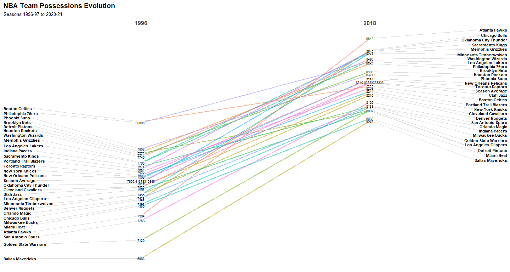
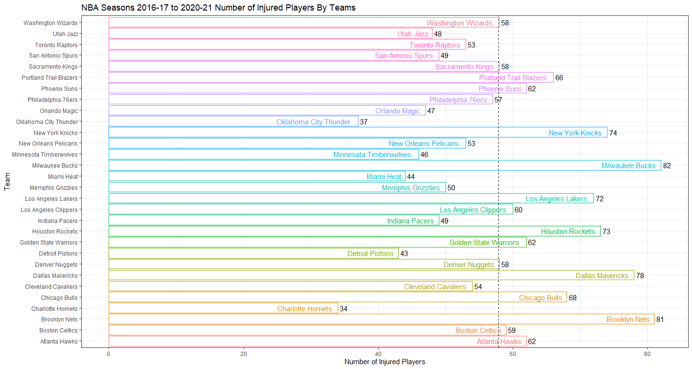
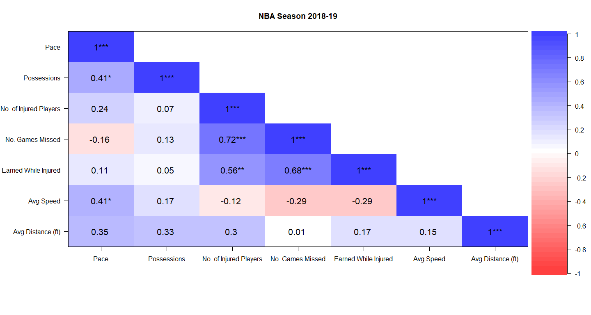

NBA Tempo & Injuries: Analyzing the Effects on Performance and Winnings
================
Reina Li, Christian Uriostegui, Ao Kong, Kaiden Vega

-   [**Introduction**](#introduction)
    -   [Background](#background)
    -   [Purpose](#purpose)
-   [**Data Set**](#data-set)
    -   [Dataset](#dataset)
    -   [Key Metrics in Championship
        Teams](#key-metrics-in-championship-teams)
-   [**Analysis**](#analysis)
    -   [Pace](#pace)
    -   [Possessions](#possessions)
    -   [Injuries](#injuries)
    -   [Speed](#speed)
    -   [Distance](#distance)
    -   [Correlation](#correlation)
    -   [Championship Success](#championship-success)
-   [**Conclusion**](#conclusion)
    -   [Observations & Insights](#observations--insights)
    -   [Recommendations](#recommendations)
    -   [Shortcomings](#shortcomings)
    -   [Next Steps](#next-steps)
-   [**Sources**](#sources)

------------------------------------------------------------------------

# **Introduction**

## Background

Player injuries have historically ruined finals matches. Teams that have
either been on the verge of a deep playoff run or even a championship
missed out due to missing a key player. This is not just a cost to the
fans but also the organizations who have to continue to pay players
during this period. We believe that an increase in tempo has likely led
to higher chances of injury. In our study, we will present our research,
insights, and possible solutions.

------------------------------------------------------------------------

## Purpose

We hope that with our recommendations, the commissioner and team owners
can take actionable steps to reduce injuries. To do that, we will be
examining different game statistics such as tempo (pace and
possessions), games and players missed due to injury as well as cash
earned during this period. and seeing how this affects championship
success

------------------------------------------------------------------------

# **Data Set**

## Dataset

-   30 NBA teams
-   playstyles
-   speed and distance
-   pace and possessions
-   injuries and money earned while injured
-   season performance

------------------------------------------------------------------------

## Key Metrics in Championship Teams

-   **possession** : counted every time a player scores, misses the
    shot, turns the ball over, or gets fouled
-   **pace** = (possessions/minutes) \* 48
-   **injuries** among teams in the finals

For our study we’ll be examining NBA teams in the finals between
2016-2020 and look at key metrics such as: **Possession** which is
counted every time a player scores, misses the shot, turns the ball over
or gets fouled; **Pace** which provides the amount of possessions in a
48 minute period (average NBA game). If tempo is increasing we will also
see this reflected in these two statistics. We will also look at
injuries among teams in the finals.

------------------------------------------------------------------------

# **Analysis**

## Pace

<!-- -->

The pace by teams is visualized above. Each of the colored dashed lines
represents the pace for each team for seasons 1996-97 to 2020-21. The
black solid line represents the average pace of all teams for each
season.

From the visualization, we see an increase in pace for NBA team over
time.

<!-- -->

To further support the previous visualization, the evolution of team
pace from seasons 1996 to 2020 is visualized above. As mentioned
earlier, we see an increase in pace for NBA team over time.

<!-- -->

Let’s take a closer look at the pace by teams. Each of the colored
dashed lines is the pace for each team over the years. The dashed black
line represents the average pace for each season, and is the same in
each facet. The solid black line represents the average pace for each
team, and is different in each facet.

From the visualization, we can see that every team has seen an increase
in pace. Also, all teams in the 2020 season have a pace greater than
their team average pace.

------------------------------------------------------------------------

## Possessions

<!-- -->

The possessions by teams is visualized above. Each of the colored dashed
lines represents the possessions for each team for seasons 1996-97 to
2020-21. The black solid line represents the average possessions of all
teams for each season.

From the visualization, we see two big dips in 1998 and 2011. The reason
for the dips in 1998 and 2011 is because the games were cut short due to
player negotiations for contracts. We also observe lower possessions for
2019 and 2020. That may be due to COVID-19, since they played less
games. Without the big drops in 1998 and 2011, and in 2019 and 2020, we
can see a small increase in possessions.

<!-- -->

In this visualization, we see the evolution of possessions from seasons
1996 to 2018. We didn’t include 2019 and 2020 in this visualization
because there were decreases due to fewer games played due to COVID-19.
As mentioned earlier, we see an overall increase in possessions for NBA
teams.

<!-- -->

Here we have a data visualization of the possessions by teams. Each of
the colored dashed lines is the possessions for each team over the
years. The dashed black line represents the average possessions for each
season, and is the same in each facet. The solid black line represents
the average possessions for each team, and is different in each facet.

------------------------------------------------------------------------

## Injuries

<!-- -->

Here we have a bar plot of the total number of injured players by teams
for 2016 to 2020. We see that Charlotte Hornets and Oklahoma City
Thunder had the fewest number of injured players, while Milwaukee Bucks,
Brooklyn Nets, and Dallas Mavericks had the highest number of injured
players. 16 of the teams had more than the average number of injured
players. That’s a lot of injuries!

<!-- -->

This is a side-by-side box-and-whisker plot, or a box plot of the cash
earned while injured by teams for seasons 2016-17 to 2020-21. Each of
the box plots contains 5 important values: the minimum, first quartile,
median or second quartile, third quartile, and maximum. The rectangle
displays the interquartile range (IQR), and lone points are outliers.

From this visualization, we can see that Brooklyn Nets has the highest
median cash earned while injured. This may be because more injuries
caused more money to be lost. Brooklyn Nets also has a very large
outlier. We also observe that Detroit Pistons have the lowest median
cash earned due to less injuries. We can also see that Golden State
Warriors has the biggest IQR, and Utah Jazz has the smallest IQR.

<!-- -->

The cash earned while injured by teams is visualized above. Each of the
colored dashed lines represents the cash earned while injured for each
team for seasons 2016-17 to 2020-21. The black solid line represents the
average cash earned while injured of all teams for each season.

From the visualization, we see an increase in cash earned while injured
over time.

<!-- -->

Now, let’s take a closer look at the cash earned while injured by teams.
Each of the colored dashed lines is the cash earned while injured for
each team over the years. The dashed black line represents the average
cash earned while injured for each season, and is the same in each
facet. The solid black line represents the average cash earned while
injured for each team, and is different in each facet.

From the visualization, we can see that even though it is not apparent
for every team, some teams, like Brooklyn Nets and Golden State
Warriors, see an increase in cash earned while injured. It seems like
teams are losing a lot of money because of injuries.

------------------------------------------------------------------------

## Speed

<!-- -->

The average speed by teams is visualized above. Each of the colored
dashed lines represents the average speed for each team for seasons
2016-17 to 2020-21. The black solid line represents the average speed of
all teams for each season.

From the visualization, we see the average speed of Cleveland Cavaliers
dropped in 2018 and 2019 because the NBA tracked one player’s speed who
only played one game, causing the team average to drop. Though not big,
we do see a slight increase in average speed over time.

------------------------------------------------------------------------

## Distance

<!-- -->

The average distance by teams is visualized above. Each of the colored
dashed lines represents the average distance for each team for seasons
2016-17 to 2020-21. The black solid line represents the average speed of
all teams for each season.

From the visualization, we can see a slight increase in average distance
by teams over time. Speed and distance are not tracked for every game
and every player, so team averages will be skewed.

------------------------------------------------------------------------

## Correlation

<!-- -->

The visualization above is a pair plot. The variable names are displayed
on the outer edges of the matrix. The scatter plot in the lower triangle
shows the relationship between two variables. In the scatter plot, we
have a loess smoother to help us see the relationship between two
variables and foresee trends. The boxes along the diagonal display the
density plot for each variable. A density plot helps us visualize the
distribution of the data. The boxes in the upper right corner display
the Pearson correlation coefficient between two variables. The Pearson
correlation, or r, gives us the magnitude and direction of the linear
relationship between two variables and has a value between -1 and +1.
The higher the absolute value of r, the stronger the correlation. -1
signifies a perfect negative linear correlation. 0 signifies no linear
relationship between the two variables. +1 signifies a perfect positive
linear correlation. There are other types of correlation; however, they
were not used: Spearman and Kendall.

Looking at the scatter plot and loess smoother, the number of games
missed and earned while injured displays a clear positive relationship.
There is also a clear positive relationship between the number of
injured players and number of games missed. There is a slight positive
linear relationship between pace and number of injured players, pace and
earned while injured, pace and average distance, possessions and average
speed, and number of injured players and earned while injured.

Looking at the density plot for possessions, we observe two peaks, which
means it is bimodal. This may be caused by looking at all the teams and
all the seasons at once. For number of games missed and earned while
injured, it looks like they are right skewed, which means that the mean
is greater than the median. For average speed, it looks like it is left
skewed, which means that the mean is less than the median.

<!-- -->

Here, we have a correlogram, or a correlation visualization.
Specifically, this is a correlation matrix. A correlation matrix is used
to analyze the correlation between multiple variables at the same time.
It is useful to highlight the most correlated variables in a data table.
In this plot, correlation coefficients are colored according to the
value, displayed as a lower triangular matrix. Significance codes are
displayed next to the Pearson correlation to represent if the variables
are statistically significant. A p-value less than or equal to 0.05 is
statistically significant. That means that there is an attributable
cause for the two variables to be correlated, and not because of chance.

From this correlation matrix, we can see a statistically significant
linear relationship between number of injured players and pace, earned
while injured and pace, average distance and pace, average speed and
possessions, number of games missed and number of injured players,
earned while injured and number of injured players, and earned while
injured and number of games missed.

<!-- -->

We have a pair plot for season 2016-17. Looking at the scatter plot and
loess smoother, pace and possessions, pace and number of injured
players, number of injured players and number of games missed, and
number of games missed and earned while injured have a clear positive
linear relationship. Looking at the density plot, the distribution of
average distance seems to be right skewed.

<!-- -->

From this correlation matrix, we can see a statistically significant
linear relationship between possessions and pace, number of injured
players and pace, number of games missed and number of injured players,
and earned while injured and number of games missed.

<!-- -->

Here, we have a pair plot for season 2017-18. Looking at the scatter
plot and loess smoother, pace and possessions, number of injured players
and number of games missed, number of injured players and earned while
injured, and number of games missed and earned while injured have a
clear positive linear relationship.

<!-- -->

From this correlation matrix, we can see a statistically significant
linear relationship between possessions and pace, number of games missed
and number of injured players, earned while injured and number of
injured players, and earned while injured and number of games missed.

<!-- -->

Here, we have a pair plot for season 2018-19. Looking at the scatter
plot and loess smoother, pace and possessions, pace and average speed,
number of injured players and number of games missed, number of injured
players and earned while injured, and number of games missed and earned
while injured have a clear positive linear relationship.

<!-- -->

From this correlation matrix, we can see a statistically significant
linear relationship between possessions and pace, average speed and
pace, number of games missed and number of injured players, earned while
injured and number of injured players, and earned while injured and
number of games missed.

<!-- -->

Here, we have a pair plot for season 2019-20. Looking at the scatter
plot and loess smoother, number of injured players and number of games
missed, number of games missed and earned while injured, and average
speed and average distance have a clear positive linear relationship.

<!-- -->

From this correlation matrix, we can see a statistically significant
linear relationship between number of games missed and number of injured
players, earned while injured and number of games missed, and average
distance and average speed.

<!-- -->

Here, we have a pair plot for season 2020-21. Looking at the scatter
plot and loess smoother, pace and possessions, pace and average speed,
and number of games missed and earned while injured have a clear
positive linear relationship. Possessions and number of injured, number
of injured players and average speed, and number of injured players and
average distance have a clear negative linear relationship.

<!-- -->

From this correlation matrix, we can see a statistically significant
linear relationship between possessions and pace, average speed and
pace, number of injured players and possessions, average speed and
number of injured players, average distance and number of injured
players, and earned while injured and number of games missed. It is
interesting to see a statistically significant negative relationship
between average speed and distance with number of injured players.

------------------------------------------------------------------------

## Championship Success

<!-- -->

From this visualization that was created using Tableau, we can see that
the higher the pace, the more likely the team wins the championship.
From 2017 to 2020, all the teams with higher pace won the championship,
except in 2016, where the Cavaliers had lower pace and won, due to a
smaller number of injured players compared to Golden State. The crown
indicates the champion team.

<!-- -->

Similarly in this visualization, the fewer number of games missed due to
injuries, the more likely the team wins the championship. In 2016 to
2019, all the teams with less games missed won the championship, except
in 2020, where the Lakers missed more games and won, due to a faster
pace compared to Miami.

------------------------------------------------------------------------

# **Conclusion**

## Observations & Insights

-   pace, possessions, speed, distance, and cash earned while injured
    increased over time
-   high correlation between number of games missed and cash earned
    while injured
-   champion teams between seasons 2016-17 to 2020-21 tended to have the
    advantage in either pace or health
-   contract negotiations and pandemic/health concerns led to a decrease
    in team possessions in 1998, 2011, 2019, and 2020
-   the more injured players, the higher the number of games missed due
    to injuries, the more money the team loses
-   the higher the pace and the fewer the number of games missed due to
    injuries, the more likely the team wins the championship

To wrap everything up, we had a couple of important observations and
insights. Our key insights were that the higher the pace, the more
likely the team wins the championship and the fewer number of games
missed, the more likely they were to win the championship as well.
Champion teams between 2016 and 2020 tended to have an advantage in
either pace or health. We observed that pace, possessions, speed,
distance, and cash earned while injured all increased over time. The
more injured players there are and the higher the number of games
missed, the more money the team loses.

------------------------------------------------------------------------

## Recommendations

-   healthy players = less likely to suffer from injuries
    -   full body scans throughout the season
    -   body-injury prevention during pre-season, possible end of year
        report
    -   ensure that traveling between games is equal among teams
    -   adequate amount of time off and breaks to rest
    -   physical therapy and post-injury treatment services
    -   cryotherapy to reduce muscle and joint pain

We recommend the commissioner, Adam Silver, and team owners to take care
of the players because healthy players are less likely to suffer from
injuries. One of our recommendations is to do full body scans throughout
the season. We found this information from an article that discussed a
study about how these scans had biometric readings on players bodies
during certain basketball motions. It would show which parts of the body
were under more strain, and which parts were weak or strong. This would
help players know which parts of their body to train or take more care
of to prevent injuries. In addition, we recommend body-injury prevention
during the pre-season with an end of the season report. We also
recommend the NBA ensure that traveling between games is equal among
teams to give players enough time to rest. Certain teams travel for
longer durations due to location, which can mess up their sleep,
circadian rhythm, and thus their performance and chances of injury.
Players should receive adequate amounts of time off and rest. If players
do get injured, they should be treated appropriately with physical
therapy services and cryotherapy to reduce muscle and joint pain.

------------------------------------------------------------------------

## Shortcomings

-   some data sets are incomplete
    -   average speed and distance were not tracked for all players and
        games
    -   NBA playstyles data only goes back to season 2015-16
-   some data is skewed
-   playstyles can be utilized in different speeds
-   teams play differently during playoffs
    -   our study only looked at statistics of regular seasons

Some shortcomings we experienced are that some of the data sets we used
were incomplete due to missing years and not all statistics were
tracked. Because of this, certain calculations may be skewed. We also
only looked at the statistics for regular seasons and not the playoffs.
Teams play differently during the playoff so that can be worth exploring
further.

------------------------------------------------------------------------

## Next Steps

-   find overlapping datasets to generate stronger insights
-   search for other indicators of tempo such as touches per play
-   look at playoff performance data
-   further examine individual player data

If we were given more time, we would love to find overlapping datasets
to generate stronger insights, analyze other indicators of tempo such as
touches per play, look at playoff performance data, and further examine
individual player data.

------------------------------------------------------------------------

# **Sources**

-   [NBA Advanced Stats](https://www.nba.com/stats/)
-   [spotrac \| Cumulative Season Injured List By
    Player](https://www.spotrac.com/nba/injured-reserve/)
-   [ESPN \| Data shows NBA injuries up in condensed
    season](https://www.espn.com/nba/story/_/id/31592404/data-shows-nba-injuries-condensed-season)
-   [Sportico \| NBA Playoff Injury Rash Extends Real Multi-Year Trend:
    Data
    Viz](https://www.sportico.com/leagues/basketball/2021/nba-playoffs-injuries-data-viz-1234633741/)
-   [Bleacher Report \| Inside the Psyche of an Injured NBA
    Superstar](https://bleacherreport.com/articles/1515597-inside-the-psyche-of-an-injured-nba-superstar)
-   [Fansided \| The Whiteboard: Injuries will impact NBA Playoffs more
    than
    ever](https://fansided.com/2021/05/05/whiteboard-injuries-may-determine-nba-title-race-ever/)
-   [ESPN \| NBA extends its disability insurance three more
    years](http://www.espn.com/sportsbusiness/s/2003/0311/1521986.html#:~:text=Disability%20insurance%20kicks%20in%20after,play%20in%2041%20consecutive%20games.)
-   [The Sporting News \| NBA Playoffs 2021: Brooklyn Nets suffer
    another injury setback in Game 4
    loss](https://www.sportingnews.com/in/nba/news/nba-playoffs-2021-brooklyn-nets-suffer-another-injury-setback-in-game-4-loss-kyrie-irving/z8bq0xg4db881fpyxf7rfdnqk)
-   [Hack a Stat \| Learn a Stat: Possessions and
    Pace](https://hackastat.eu/en/learn-a-stat-possessions-and-pace/#:~:text=The%20answer%20is%20no%3B%20Pace%20%28and%20possessions%29%20are,League%20Pace%20is%20around%2074%20possessions%20per%20game.)
-   [University of Rochester Medical Center \| Orthopaedics & Physical
    Performance: Sports Medicine: Basketball
    Injuries](https://www.urmc.rochester.edu/orthopaedics/sports-medicine/basketball-injuries.cfm)
-   [ESPN \| The cutting edge: Injury prediction and
    prevention](https://www.espn.com/nba/story/_/id/16009403/cutting-edge-injury-prediction-prevention)
-   [The Guardian \| How sleep and jet-lag influences success in the
    travel-crazy
    NBA](https://www.theguardian.com/sport/2018/oct/26/sleep-nba-effects-basketball)
-   [Medium \| “It’s a Very Big Issue”: Inside the NBA’s Sleeping
    Problem](https://medium.com/basketball-university/inside-the-nbas-sleeping-problem-cb5d34968b5f)
