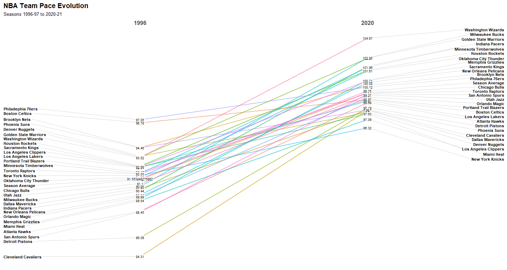
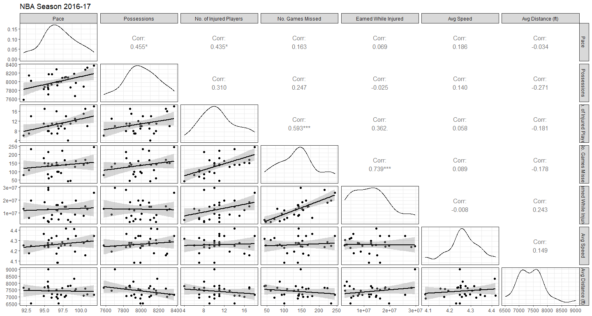
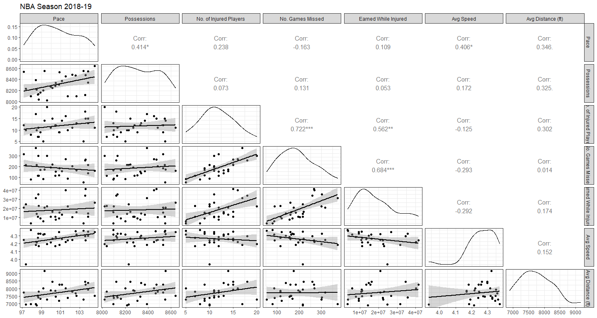

NBA Tempo & Injuries: Analyzing the Effects on Performance and Winnings
================
Reina Li, Christian Uriostegui, Ao Kong, Kaiden Vega

-   [**Introduction**](#introduction)
    -   [Background](#background)
    -   [Purpose](#purpose)
-   [**Data Set**](#data-set)
    -   [Dataset](#dataset)
    -   [Pace and Possession](#pace-and-possession)
    -   [Injuries](#injuries)
    -   [Performance](#performance)
-   [**Analysis**](#analysis)
    -   [Key Notes: Pace](#key-notes-pace)
    -   [Key Notes: Possession](#key-notes-possession)
    -   [Key Notes: Cash earned while
        injured](#key-notes-cash-earned-while-injured)
    -   [Key Notes: Speed and Distance](#key-notes-speed-and-distance)
    -   [Key Notes: Correlation](#key-notes-correlation)
    -   [Key Notes: Championships](#key-notes-championships)
-   [**Conclusion**](#conclusion)
    -   [Observations](#observations)
    -   [Insights](#insights)
    -   [Recommendations](#recommendations)
    -   [Shortcomings](#shortcomings)
    -   [Results and Lessons Learned](#results-and-lessons-learned)
    -   [Next Steps](#next-steps)
-   [**Sources**](#sources)

------------------------------------------------------------------------

# **Introduction**

## Background

In the NBA, team organizations have suffered tremendously due to
injuries. Some injuries have even cost championships. However, games
aren’t the only thing that teams lose; organizations also lose money by
paying out contracts to players who are unable to play due to injuries.

------------------------------------------------------------------------

## Purpose

**Client**: Adam Silver, Commissioner of the National Basketball
Association (2014-present)

-   Identify trends of different game statistics:
    -   pace
    -   possessions
    -   speed
    -   distance
    -   number of games missed due to injuries
    -   number of injured players
    -   cash earned while injured
    -   playstyles
-   explore patterns/relationships between tempo, injuries, and winnings
-   provide recommendations on how the NBA can reduce injuries overall
    and save money on injured players’ contracts

------------------------------------------------------------------------

# **Data Set**

## Dataset

-   30 NBA teams
-   playstyles (seasons 2015-16 to 2021-21)
-   speed and distance (seasons 2013-14 to 2020-21)
-   pace and possessions (seasons 1996-97 to 2020-21)
-   injuries and money earned while injured (seasons 2016-17 to 2021-21)
-   season performance

------------------------------------------------------------------------

## Pace and Possession

-   **pace** = (possessions/minutes) \* 40

-   **possession** : the action of a player getting the ball and the
    play ends in a field goal/free throw made, opponent rebound, or a
    turnover

-   examine trends between pace and possession over time

-   find a potential correlation between pace and possession

------------------------------------------------------------------------

## Injuries

-   teams with highest injuries
-   financial losses due to injuries (league paying injured players with
    a contract who do not play)
-   examine a potential correlation between tempo and injuries

------------------------------------------------------------------------

## Performance

-   examine the performance of teams that have made it to the playoff
    finals within our time frame
-   find out if there is a correlation between:
    -   tempo and performance
    -   injuries and performance

------------------------------------------------------------------------

# **Analysis**

<!-- -->

The pace by teams is visualized above. Each of the colored dashed lines
represents the pace for each team for seasons 1996-97 to 2020-21. The
black solid line represents the average pace of all teams for each
season.

From the visualization, we see an increase in pace for NBA team over
time.

<!-- -->

To further support the previous visualization, the evolution of team
pace from seasons 1996 to 2020 is visualized above. As mentioned
earlier, we see an increase in pace for NBA team over time.

<!-- -->

Let’s take a closer look at the pace by teams. Each of the colored
dashed lines is the pace for each team over the years. The dashed black
line represents the average pace for each season, and is the same in
each facet. The solid black line represents the average pace for each
team, and is different in each facet.

From the visualization, we can see that every team has seen an increase
in pace. Also, all teams in the 2020 season have a pace greater than
their team average pace.

------------------------------------------------------------------------

## Key Notes: Pace

-   a steady increase in the league over time
-   apparent in every single NBA team
-   all teams in the 2020 season have a pace greater than their team
    average pace

------------------------------------------------------------------------

<!-- -->

The possessions by teams is visualized above. Each of the colored dashed
lines represents the possessions for each team for seasons 1996-97 to
2020-21. The black solid line represents the average possessions of all
teams for each season.

From the visualization, we see two big dips in 1998 and 2011. The reason
for the dips in 1998 and 2011 is because the games were cut short due to
boycotts and negotiations for contracts. We also observe lower
possessions for 2019 and 2020. That may be due to COVID-19, since they
played less games. Without the big drops in 1998 and 2011, and in 2019
and 2020, we can see a small increase in possessions.

<!-- -->

In this visualization, we see the evolution of possessions from seasons
1996 to 2018. We didn’t include 2019 and 2020 in this visualization
because there were decreases due to fewer games played due to COVID-19.
As mentioned earlier, we see an overall increase in possessions for NBA
teams.

<!-- -->

Here we have a data visualization of the possessions by teams. Each of
the colored dashed lines is the possessions for each team over the
years. The dashed black line represents the average possessions for each
season, and is the same in each facet. The solid black line represents
the average possessions for each team, and is different in each facet.

------------------------------------------------------------------------

## Key Notes: Possession

-   a steady increase over time
-   dips observed
    -   1998 and 2011- contract negotiations
    -   2019 and 2020- less games played due to COVID-19

------------------------------------------------------------------------

This visualization created using Tableau, shows the playstyles ranked
from seasons 2015 to 2020. We see that the playstyles: spot up, ball
handler, transition, and cut are ranked highly and their ranks did not
change much. We can see that the dynamic playstyles are becoming more
popular than non-dynamic playstyles, such as post up, isolation, roll
man, and putbacks.

<!-- -->

This is a side-by-side box-and-whisker plot, or a box plot of the cash
earned while injured by teams for seasons 2016-17 to 2020-21. Each of
the box plots contains 5 important values: the minimum, first quartile,
median or second quartile, third quartile, and maximum. The rectangle
displays the interquartile range (IQR), and lone points are outliers.

From this visualization, we can see that Brooklyn Nets has the highest
median cash earned while injured. This may be because more injuries
caused more money to be lost. Brooklyn Nets also has a very large
outlier. We also observe that Detroit Pistons has the lowest median cash
earned while injured. This may be because the team didn’t lose as much
money as other teams because they had less injuries. We can also see
that Golden State Warriors has the biggest IQR, and Utah Jazz has the
smallest IQR. It seems like teams are losing a lot of money because of
injuries.

<!-- -->

The cash earned while injured by teams is visualized above. Each of the
colored dashed lines represents the cash earned while injured for each
team for seasons 2016-17 to 2020-21. The black solid line represents the
average cash earned while injured of all teams for each season.

From the visualization, we see an increase in cash earned while injured
over time.

<!-- -->

Now, let’s take a closer look at the cash earned while injured by teams.
Each of the colored dashed lines is the cash earned while injured for
each team over the years. The dashed black line represents the average
cash earned while injured for each season, and is the same in each
facet. The solid black line represents the average cash earned while
injured for each team, and is different in each facet.

From the visualization, we can see that even though it is not apparent
for every team, some teams, like Brooklyn Nets and Golden State
Warriors, see an increase in cash earned while injured.

------------------------------------------------------------------------

## Key Notes: Cash earned while injured

-   an increase in average cash earned while injured
-   Brooklyn Nets have the highest median cash earned while injured
-   Detroit Pistons have the lowest median cash earned while injured
-   teams are losing a lot of money because of injuries

------------------------------------------------------------------------

<!-- -->

The average speed by teams is visualized above. Each of the colored
dashed lines represents the average speed for each team for seasons
2016-17 to 2020-21. The black solid line represents the average speed of
all teams for each season.

From the visualization, we see the average speed of Cleveland Cavaliers
dropped in 2018 and 2019. That may be because NBA tracked one player who
only played one game, and that player’s speed made the team’s average
drop. Also, speed is not tracked for every game and every player, so
team averages will be skewed. Though not big, we do see a slight
increase in average speed over time.

<!-- -->

The average distance by teams is visualized above. Each of the colored
dashed lines represents the average distance for each team for seasons
2016-17 to 2020-21. The black solid line represents the average speed of
all teams for each season.

From the visualization, we can see a slight increase in average distance
by teams over time. Also, distance is not tracked for every game and
every player, so team averages will be skewed.

------------------------------------------------------------------------

## Key Notes: Speed and Distance

-   players have more mileage
-   the distance in games have increased
    -   speed and distance is missing for some players and games
    -   numbers can be skewed because of players that have played small
        minutes
-   comparing 2013 to 2020, speed is higher in 2020
    -   peaked in 2017, though downtrending, it looks likt it’s making
        its way back up

------------------------------------------------------------------------

<!-- -->

The visualization above is a pair plot. The variable names are displayed
on the outer edges of the matrix. The scatter plot in the lower triangle
shows the relationship between two variables. In the scatter plot, we
have a loess smoother to help us see the relationship between two
variables and foresee trends. The boxes along the diagonal display the
density plot for each variable. A density plot helps us visualize the
distribution of the data. The boxes in the upper right corner display
the Pearson correlation coefficient between two variables. The Pearson
correlation, or r, gives us the magnitude and direction of the linear
relationship between two variables and has a value between -1 and +1.
The higher the absolute value of r, the stronger the correlation. -1
signifies a perfect negative linear correlation. 0 signifies no linear
relationship between the two variables. +1 signifies a perfect positive
linear correlation. There are other types of correlation; however, they
were not used: Spearman and Kendall.

Looking at the scatter plot and loess smoother, the number of games
missed and earned while injured displays a clear positive relationship.
There is also a clear positive relationship between the number of
injured players and number of games missed. There is a slight positive
linear relationship between pace and number of injured players, pace and
earned while injured, pace and average distance, possessions and average
speed, and number of injured players and earned while injured.

Looking at the density plot for possessions, we observe two peaks, which
means it is bimodal. This may be caused by looking at all the teams and
all the seasons at once. For number of games missed and earned while
injured, it looks like they are right skewed, which means that the mean
is greater than the median. For average speed, it looks like it is left
skewed, which means that the mean is less than the median.

<!-- -->

Here, we have a correlogram, or a correlation visualization.
Specifically, this is a correlation matrix. A correlation matrix is used
to analyze the correlation between multiple variables at the same time.
It is useful to highlight the most correlated variables in a data table.
In this plot, correlation coefficients are colored according to the
value, displayed as a lower triangular matrix. Significance codes are
displayed next to the Pearson correlation to represent if the variables
are statistically significant. A p-value less than or equal to 0.05 is
statistically significant. That means that there is an attributable
cause for the two variables to be correlated, and not because of chance.

From this correlation matrix, we can see a statistically significant
linear relationship between number of injured players and pace, earned
while injured and pace, average distance and pace, average speed and
possessions, number of games missed and number of injured players,
earned while injured and number of injured players, and earned while
injured and number of games missed.

<!-- -->

We have a pair plot for season 2016-17. Looking at the scatter plot and
loess smoother, pace and possessions, pace and number of injured
players, number of injured players and number of games missed, and
number of games missed and earned while injured have a clear positive
linear relationship. Looking at the density plot, the distribution of
average distance seems to be right skewed.

<!-- -->

From this correlation matrix, we can see a statistically significant
linear relationship between possessions and pace, number of injured
players and pace, number of games missed and number of injured players,
and earned while injured and number of games missed.

<!-- -->

Here, we have a pair plot for season 2017-18. Looking at the scatter
plot and loess smoother, pace and possessions, number of injured players
and number of games missed, number of injured players and earned while
injured, and number of games missed and earned while injured have a
clear positive linear relationship.

<!-- -->

From this correlation matrix, we can see a statistically significant
linear relationship between possessions and pace, number of games missed
and number of injured players, earned while injured and number of
injured players, and earned while injured and number of games missed.

<!-- -->

Here, we have a pair plot for season 2018-19. Looking at the scatter
plot and loess smoother, pace and possessions, pace and average speed,
number of injured players and number of games missed, number of injured
players and earned while injured, and number of games missed and earned
while injured have a clear positive linear relationship.

<!-- -->

From this correlation matrix, we can see a statistically significant
linear relationship between possessions and pace, average speed and
pace, number of games missed and number of injured players, earned while
injured and number of injured players, and earned while injured and
number of games missed.

<!-- -->

Here, we have a pair plot for season 2019-20. Looking at the scatter
plot and loess smoother, number of injured players and number of games
missed, number of games missed and earned while injured, and average
speed and average distance have a clear positive linear relationship.

<!-- -->

From this correlation matrix, we can see a statistically significant
linear relationship between number of games missed and number of injured
players, earned while injured and number of games missed, and average
distance and average speed.

<!-- -->

Here, we have a pair plot for season 2020-21. Looking at the scatter
plot and loess smoother, pace and possessions, pace and average speed,
and number of games missed and earned while injured have a clear
positive linear relationship. Possessions and number of injured, number
of injured players and average speed, and number of injured players and
average distance have a clear negative linear relationship.

<!-- -->

From this correlation matrix, we can see a statistically significant
linear relationship between possessions and pace, average speed and
pace, number of injured players and possessions, average speed and
number of injured players, average distance and number of injured
players, and earned while injured and number of games missed.

------------------------------------------------------------------------

## Key Notes: Correlation

-   **number of games missed** and **earned while injured** have a
    ***strong*** positive linear relationship
-   **pace** and **possessions** have a positive linear relationship
-   **number of games missed** and **number of injured players** have a
    positive linear relationship
-   **earned while injured** and **number of injured players** have a
    positive linear relationship

------------------------------------------------------------------------

From this visualization that was created using Tableau, we can see that
the higher the pace, the more likely the team wins the championship. We
can see that from 2017 to 2020, all the teams with higher pace won the
championship, except in 2016, where the team with lower pace won.

Similarly in this visualization, we can see that the fewer number of
games missed due to injuries, the more likely the team wins the
championship. We can see that from 2016 to 2019, all the teams with less
games missed won the championship, except in 2020, where the team with
more games missed won. That might be because Miami Heat’s pace was less
than Los Angeles Lakers.

------------------------------------------------------------------------

## Key Notes: Championships

-   champions seem to either have a faster pace or less injuries
-   **insight**: the higher the pace, the more likely the team wins the
    championship
-   **insight**: the fewer the number of games missed, the more likely
    they win the championship
-   though not sole factor, tempo and team health plays a role in
    winning a championship

------------------------------------------------------------------------

# **Conclusion**

## Observations

-   pace, possessions, speed, distance, and cash earned while injured
    increased over time
-   high correlation between number of games missed and cash earned
    while injured
-   dynamic plays steadily became more popular as compared to
    non-dynamic plays
-   champion teams between seasons 2016-17 to 2020-21 tended to have the
    advantage in either pace or health

------------------------------------------------------------------------

## Insights

-   contract negotiations and pandemic/health concerns led to a decrease
    in team possessions in 1998, 2011, 2019, and 2020
-   the more injured players, the higher the number of games missed due
    to injuries, the more money the team loses
-   the higher the pace and the fewer the number of games missed due to
    injuries, the more likely the team wins the championship

------------------------------------------------------------------------

## Recommendations

-   healthy players = less likely to suffer from injuries
    -   pre-season physical examinations
    -   athletic coach/trainer/specialist services to maintain proper
        fitness
    -   proper stretching before going to play
    -   adequate amount of time off and breaks to rest
    -   physical therapy and post-injury treatment services
-   wear well-fitted, basketball gear and equipment

------------------------------------------------------------------------

## Shortcomings

-   some data sets are incomplete
    -   average speed and distance were not tracked for all players and
        games
    -   NBA playstyles data only goes back to season 2015-16
-   some data is skewed
-   playstyles can be utilized in different speeds
-   teams play differently during playoffs
    -   our study only looked at statistics of regular seasons

------------------------------------------------------------------------

## Results and Lessons Learned

-   generally faster paced games lead to more injuries and win towards
    the championships
-   deciding what metrics to include
-   finding ways to display the data
-   what or what not to include

------------------------------------------------------------------------

## Next Steps

-   smaller range of seasons
-   specific playstyles
-   specific teams
-   dive deeper into the data by analyzing player data

------------------------------------------------------------------------

# **Sources**

-   [NBA Advanced Stats](https://www.nba.com/stats/)
-   [spotrac \| Cumulative Season Injured List By
    Player](https://www.spotrac.com/nba/injured-reserve/)
-   [ESPN \| Data shows NBA injuries up in condensed
    season](https://www.espn.com/nba/story/_/id/31592404/data-shows-nba-injuries-condensed-season)
-   [Sportico \| NBA Playoff Injury Rash Extends Real Multi-Year Trend:
    Data
    Viz](https://www.sportico.com/leagues/basketball/2021/nba-playoffs-injuries-data-viz-1234633741/)
-   [Bleacher Report \| Inside the Psyche of an Injured NBA
    Superstar](https://bleacherreport.com/articles/1515597-inside-the-psyche-of-an-injured-nba-superstar)
-   [Fansided \| The Whiteboard: Injuries will impact NBA Playoffs more
    than
    ever](https://fansided.com/2021/05/05/whiteboard-injuries-may-determine-nba-title-race-ever/)
-   [ESPN \| NBA extends its disability insurance three more
    years](http://www.espn.com/sportsbusiness/s/2003/0311/1521986.html#:~:text=Disability%20insurance%20kicks%20in%20after,play%20in%2041%20consecutive%20games.)
-   [The Sporting News \| NBA Playoffs 2021: Brooklyn Nets suffer
    another injury setback in Game 4
    loss](https://www.sportingnews.com/in/nba/news/nba-playoffs-2021-brooklyn-nets-suffer-another-injury-setback-in-game-4-loss-kyrie-irving/z8bq0xg4db881fpyxf7rfdnqk)
-   [Hack a Stat \| Learn a Stat: Possessions and
    Pace](https://hackastat.eu/en/learn-a-stat-possessions-and-pace/#:~:text=The%20answer%20is%20no%3B%20Pace%20%28and%20possessions%29%20are,League%20Pace%20is%20around%2074%20possessions%20per%20game.)
-   [University of Rochester Medical Center \| Orthopaedics & Physical
    Performance: Sports Medicine: Basketball
    Injuries](https://www.urmc.rochester.edu/orthopaedics/sports-medicine/basketball-injuries.cfm)
